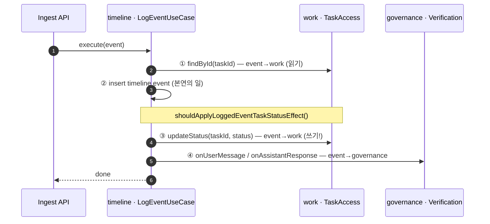
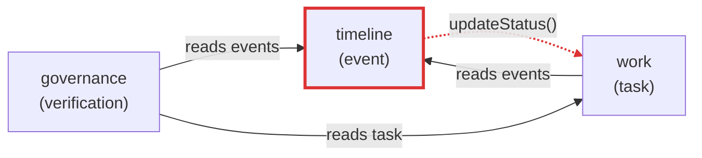
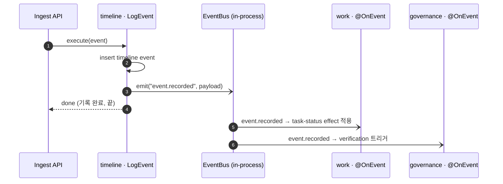
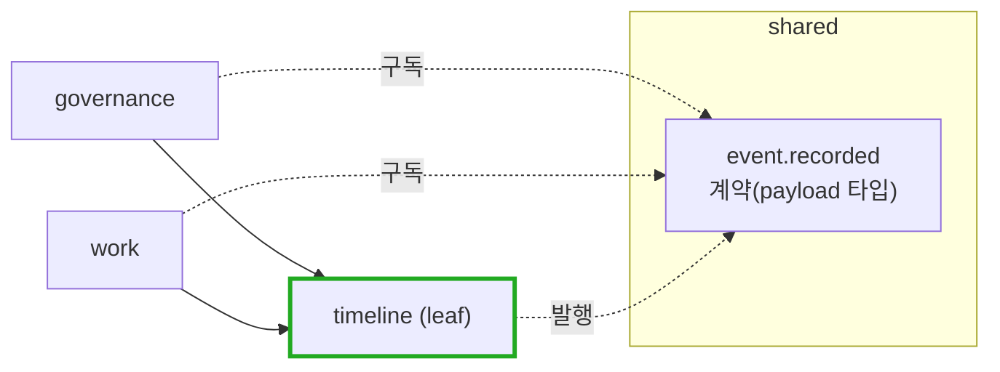
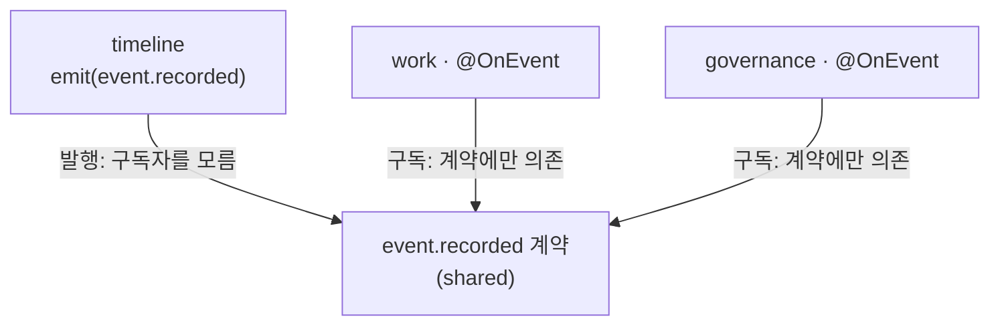
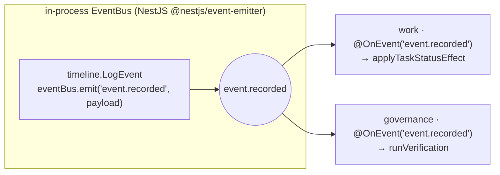

# 왜 in-process 도메인 이벤트를 도입했는가

> 대상: `timeline`(event) ↔ `work`(task) ↔ `governance`(verification) 경계.
> 관점: 히스토리가 아니라 **원인 → 결과 → 해결**.

---

## TL;DR

이벤트를 "기록"하는 usecase(`timeline.LogEvent`)가 기록만 하지 않고 **task 상태를 직접 바꾸고**, **verification을 직접 호출**했다. 이 한 줄짜리 동기 호출 사슬이 `timeline`을 다른 두 컨텍스트에 묶어 — 의존 그래프에 **역방향·순환**을 만들고, `timeline`이 leaf가 되지 못하게 했다.

해결: `timeline.LogEvent`는 **`event.recorded` 이벤트를 발행만** 하고, `work`·`governance`가 **구독해서 자기 반응을 자기가 소유**한다. 호출이 사라지고 구독으로 바뀌면서 의존 화살표가 한 방향(DAG)으로 정렬됐다.

---

## 1. 문제: "기록" usecase가 3개 컨텍스트를 오케스트레이션했다

`LogEventUseCase.execute()` 가 실제로 하던 일:

즉 "이벤트 한 건을 기록한다"는 행위 안에 **세 컨텍스트의 결정**이 박혀 있었다:

| # | 호출 | 방향 | 성격 |
|---|---|---|---|
| ① | `tasks.findById` | timeline → work | task 읽기 |
| ③ | `tasks.updateStatus` | timeline → work | **task 상태를 timeline이 바꿈** |
| ④ | `verification.onUserMessage(...)` | timeline → governance | **검증을 timeline이 트리거** |

`timeline`이 가장 아래 토대(leaf)여야 하는데, 거꾸로 `work`와 `governance`를 **호출**하고 있었다.

---

## 2. 이벤트를 도입하지 않으면 — 어떤 상태이고 무엇이 문제인가

### 2.1 의존 그래프가 순환이 된다

- `work → timeline`(이벤트 읽기)인데 동시에 `timeline → work`(상태 변경) → **양방향 순환**.
- `timeline → governance`(검증 트리거)도 역방향(governance가 timeline을 읽어야 정상).
- 결과: **DAG가 아니다.** 위상 정렬이 불가능하고, 어느 컨텍스트도 단독으로 설명·추출되지 않는다.

### 2.2 원인 → 결과

| 원인 (이벤트 없음 = 직접 호출) | 결과 (문제) |
|---|---|
| timeline이 `ITaskAccess`·`IVerificationPostProcessor`를 주입받아 호출 | **강결합** — timeline 코드가 work/governance의 계약을 컴파일타임에 알아야 함 |
| 호출 화살표가 timeline → work / governance | **순환 의존** — leaf 불성립, 위상 정렬 불가 |
| "이벤트 기록 = task 완료 결정 + 검증"이 한 usecase | **책임 오배치** — task 상태 결정이 work가 아닌 timeline에 |
| verification·updateStatus가 기록과 같은 동기 경로 | **실패 전파** — 검증/상태변경 실패가 *이벤트 기록 자체*를 오염 (부분 성공·롤백 문제) |
| timeline을 떼려면 work·governance 클라이언트 동반 | **추출 불가** — "iservice를 endpoint로 노출하면 끝"이라던 microservice-readiness가 거짓이 됨 |
| event 단위 테스트가 task·verification에 의존 | **테스트 비용** — 순수 기록 로직 검증에 두 컨텍스트를 mock/부팅 |

### 2.3 인터페이스(port/adapter)로는 왜 안 풀리나

`timeline`은 이미 `ITaskAccess`·`IVerificationPostProcessor` **포트**를 거쳐 호출했다. 그래도 위 문제가 남는다 —

> **인터페이스는 *구현* 결합만 없앤다. *방향*과 *순환*은 그대로다.**
> `timeline`이 인터페이스를 import해도 화살표는 여전히 `timeline → work/governance`다. 순환은 인터페이스로 못 끊는다. 끊으려면 **화살표를 뒤집어야**(= 호출을 구독으로) 한다.

---

## 3. 이벤트를 도입하면 — 어떻게 해결되는가

### 3.1 기록은 발행만, 반응은 구독자가 소유

- `timeline.LogEvent`의 책임 = **이벤트를 기록하고 사실을 발행한다.** 그게 전부.
- `work`가 `event.recorded`를 구독해 **task 상태 효과를 자기가 결정·적용** (책임 제자리).
- `governance`가 `event.recorded`를 구독해 **검증을 자기가 트리거** (책임 제자리).

### 3.2 의존 그래프가 DAG로 정렬된다

- `timeline`은 **누구도 위로 의존하지 않는 leaf**가 된다.
- `governance → timeline`, `work → timeline` 만 남는다 → **단방향 DAG**.

### 3.3 원인 → 결과 (해결)

| 도입 (호출 → 구독) | 결과 (해결) |
|---|---|
| timeline은 `event.recorded`만 발행 | **timeline = 순수 leaf**, work/governance 계약 모름 |
| work/governance가 구독해 반응 소유 | **책임 제자리** (task 상태는 work, 검증은 governance) |
| 발행자가 구독자를 모름 | **제어흐름 역전** — 누가/언제 반응하는지 timeline이 모름 |
| 구독 실패는 발행 경로 밖 | **실패 격리** — 검증 실패가 이벤트 기록을 막지 않음 |
| 발행/구독이 이벤트 계약에만 의존 | **추출 가능** — in-process emitter를 브로커로 바꾸면 그대로 MSA |
| event 테스트는 발행 여부만 검증 | **테스트 단순화** — 구독자는 각자 독립 테스트 |

---

## 4. 핵심 원리 — 왜 "구독"은 의존을 안 뒤집나

- **발행자**(`timeline`)는 구독자의 존재를 모른다 → 구독자에게 의존하지 않는다.
- **구독자**(`work`/`governance`)는 *이벤트 계약*에 의존한다 → 화살표는 `구독자 → 계약`.
- 계약(`event.recorded` payload)은 **`shared`에 둔다** → 모두가 아래(`shared`)만 바라본다.

> 직접 호출은 "호출자 → 피호출자"로 의존이 흐른다.
> 이벤트는 "양쪽 → 공유 계약"으로 흐른다. **그래서 순환이 사라진다.**

---

## 5. 메커니즘 — 경량 in-process

| 측면 | 선택 | 이유 |
|---|---|---|
| 전송 | in-process EventEmitter | 같은 프로세스, 인프라 0. MVP에 충분 |
| 계약 위치 | `@monitor/shared` | 발행/구독 모두 아래만 의존 |
| 발행 | `LogEvent`가 기록 직후 `emit` | 기록은 동기, 반응은 디커플 |
| 구독 | `work`/`governance`의 `@OnEvent` 핸들러 | 반응 책임을 owner가 소유 |

**MSA 전환 시:** in-process emitter를 메시지 브로커(Redis Stream/Kafka)로 교체. **구독자 핸들러 코드는 그대로** — 발행/구독 계약만 유지되면 transport는 갈아끼우면 된다.

---

## 6. Trade-off (도입의 비용)

| 비용 | 완화 |
|---|---|
| 호출 흐름이 암묵적(코드로 안 보임) | 이벤트 카탈로그 문서 + 명명 규약(`<aggregate>.<past-tense>`) |
| 구독자 실패가 발행자에 안 보임(의도) | 핸들러 내부 재시도/dead-letter는 후속(브로커 전환 시) |
| 발행–구독 순서 보장 약함 | 순서 의존 로직은 한 구독자 안에서 처리 |

---

## 한 줄 결론

> 문제의 본질은 **"기록"이라는 행위에 다른 컨텍스트의 결정(상태변경·검증)이 동기 호출로 박혀 있던 것**이다.
> 인터페이스로는 방향을 못 바꾼다. **이벤트(발행/구독)만이 화살표를 뒤집어** `timeline`을 leaf로 만들고 순환을 DAG로 편다.
