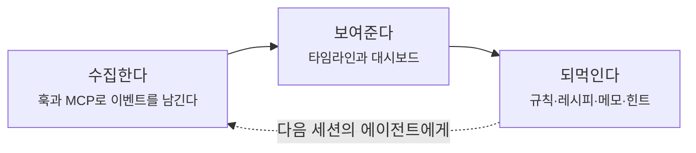
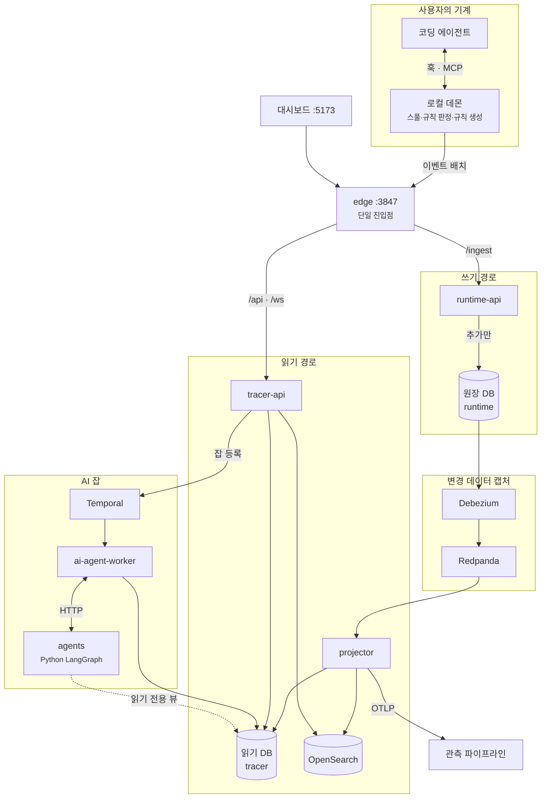
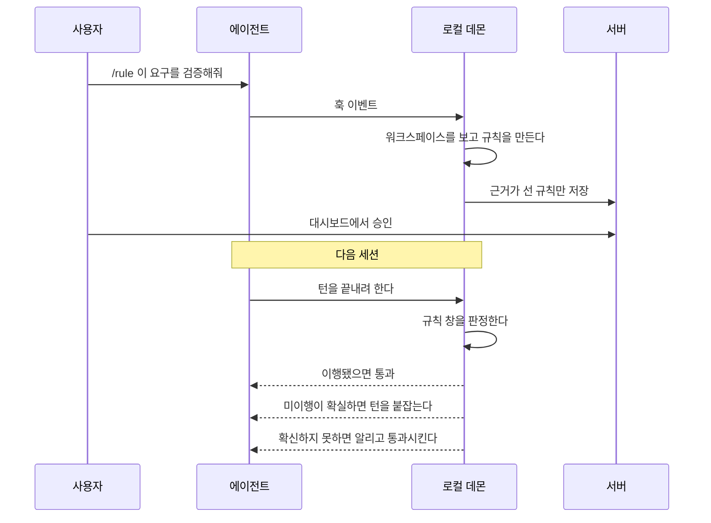
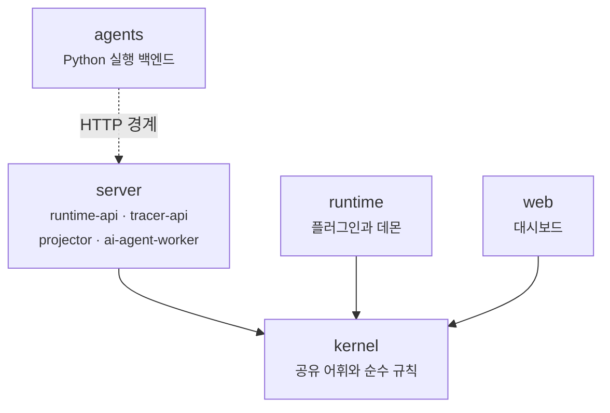

# Agent Tracer

코딩 에이전트의 활동을 수집하고 조회하고 분석하는 모니터링 시스템이다.

에이전트가 무엇을 읽고 무엇을 고쳤고 어떤 명령을 실행했는지가 세션이 끝나면 사라진다.
Agent Tracer는 그것을 원장에 남기고, 타임라인으로 보여주고, 반복되는 패턴에서 규칙과 레시피를
길어 올려 다음 세션의 에이전트에게 되먹인다.

## 무엇을 하는가



**수집한다.** 에이전트 런타임에 플러그인으로 붙어 도구 호출, 파일 변경, 명령 실행, 사용자 입력,
권한 요청을 이벤트로 남긴다. 로컬 데몬이 이벤트를 모아 서버로 보내고, 서버가 죽어 있으면
스풀에 쌓아 두었다가 나중에 보낸다. 수집이 사용자의 작업을 붙잡지 않는다.

**보여준다.** 대시보드가 태스크와 세션과 턴을 타임라인으로 그린다. 어느 도구가 무엇을 했고
어디서 실패했는지 이벤트 단위로 파고들 수 있다. 전문 검색으로 이벤트와 태스크를 찾고,
태그로 태스크를 묶고, 메모로 맥락을 남긴다.

**되먹인다.** AI 에이전트가 쌓인 궤적을 읽고 규칙과 레시피를 제안한다.
승인된 규칙은 다음 세션에서 실제로 집행된다. 규칙과 레시피와 힌트를 맥락으로 주입하고,
규칙을 이행하지 않은 턴은 끝나지 못하게 붙잡는다. 이 되먹임이 이 시스템의 목적이다.

## 한눈에 보는 구조

쓰기와 읽기가 데이터베이스를 공유하지 않는다. 둘을 잇는 것은 변경 데이터 캡처다.



에이전트가 보낸 이벤트는 쓰기 전용 API가 원장에 추가만 한다. 변경 데이터 캡처가 원장을
스트림으로 흘리고, 투영기가 그것을 소비해 읽기 모델을 만든다. 조회 API는 읽기 모델만 본다.
그래서 수집은 항상 빠르고, 읽기 모델은 언제든 원장에서 다시 만들 수 있다.

AI 잡은 조회 API가 직접 실행하지 않는다. 내구성 있는 오케스트레이션 엔진이 워크플로를 돌리고,
재시도와 시간 초과와 취소를 소유한다.

## 시작하기

이 시스템은 두 조각이다. 활동을 수집하는 에이전트 쪽 플러그인과, 그것을 받아 저장하고 보여주고
분석하는 서버다. 둘 다 있어야 쓸 수 있다. 플러그인만 깔면 이벤트가 로컬 스풀에 쌓이다 버려지고,
서버만 띄우면 아무것도 들어오지 않는다.

| 필요한 것 | 버전 | 왜 |
|---|---|---|
| Node | 24.x | 다른 버전에서는 네이티브 의존성이 로드되지 않고 훅 번들이 실행되지 않는다 |
| Docker | Compose v2 | 데이터베이스 둘, 브로커, 변경 데이터 캡처, 검색, 오케스트레이션 엔진을 띄운다 |

### 1. 서버를 띄운다

앱 이미지를 이 저장소에서 빌드하므로 클론이 필요하다.

```bash
git clone https://github.com/belljun3395/agent-tracer.git
cd agent-tracer
npm run stack:up     # 배포되는 이미지 그대로 인프라와 앱을 전부 띄운다
```

| 주소 | 무엇 |
|---|---|
| `http://127.0.0.1:3847` | 수집과 조회의 단일 진입점 |
| `http://127.0.0.1:5173` | 대시보드 |
| `http://127.0.0.1:8233` | 오케스트레이션 엔진의 워크플로 화면 |

내릴 때는 `npm run stack:down`, 로그는 `npm run stack:logs`다.

### 2. 감시할 에이전트에 플러그인을 붙인다

Claude Code에서는 이렇게 한다.

```
/plugin marketplace add belljun3395/agent-tracer
/plugin install agent-tracer-monitor@agent-tracer
```

플러그인은 기본으로 `http://127.0.0.1:3847`을 향한다. 서버를 다른 호스트에 띄웠다면
`MONITOR_BASE_URL`로 옮긴다. 훅이 자기 버전과 데몬의 버전을 비교해 다르면 데몬을 갱신하므로,
플러그인을 업데이트한 뒤 수동으로 재시작할 필요가 없다.

### 3. 쓴다

이제 에이전트를 평소처럼 쓰면 된다. 대시보드에 태스크와 세션이 쌓이고, 궤적이 모이면
규칙과 레시피를 제안받을 수 있다. 승인한 규칙은 다음 세션부터 집행된다.

## 대시보드

| 화면 | 무엇을 본다 |
|---|---|
| `/tasks` | 태스크 목록. 상태·태그·검색으로 거른다 |
| `/tasks/:id` | 한 태스크의 타임라인. 턴과 이벤트를 파고든다 |
| `/rules` | 규칙과 그 판정 결과, 규칙을 낳은 발화 |
| `/recipes` | 레시피 후보와 채택된 레시피, 적용 이력 |
| `/memos` | 에이전트와 사람이 남긴 메모 |
| `/tags` | 태그 관리와 태그별 태스크 모아보기 |
| `/jobs` | AI 잡의 진행 상황과 궤적과 비용 |
| `/settings` | 언어 모델 키, 에이전트 백엔드, 정리 정책 |

데몬은 자기 제어 화면을 `http://127.0.0.1:3848`에 따로 서빙한다. 파이프라인 상태, 개입 기록,
규칙 발동, 스풀, 데드레터 재투입을 여기서 본다. 대시보드가 아니라 데몬이 서빙하는 이유는
파이프라인이 죽었을 때 쓰는 화면이기 때문이다.

## 되먹임은 이렇게 돈다



규칙은 언제나 그것을 낳은 하나의 발화에 묶인다. 판정은 이행될 때까지 살아 있고,
관측이 불완전한 창에서는 막지 않고 알리기만 한다.

레시피는 반대 방향이다. 서버의 AI 잡이 쌓인 태스크에서 재사용 가능한 절차를 길어 올리고,
승인된 레시피는 다음 세션의 맥락으로 주입되거나 에이전트가 MCP 도구로 직접 검색한다.

## 배포 단위



| 패키지 | 하는 일 |
|---|---|
| `packages/kernel` | 배포 단위가 공유하는 어휘와 순수 도메인 규칙 |
| `packages/runtime` | 에이전트 쪽 수집기 플러그인과 로컬 데몬 |
| `packages/web` | 대시보드 |
| `packages/agents` | Python으로 구현한 에이전트 실행 백엔드 |
| `packages/server/apps/runtime-api` | 쓰기 전용 수집 API |
| `packages/server/apps/tracer-api` | 조회와 잡 등록과 실시간 전송 |
| `packages/server/apps/projector` | 원장을 소비해 읽기 모델로 투영 |
| `packages/server/apps/ai-agent-worker` | AI 잡의 오케스트레이션 |
| `packages/server/libs/platform` | 여러 앱이 함께 쓰는 기술 기반 |
| `packages/server/libs/tracer-domain` | 읽기 모델의 엔티티와 저장소와 도메인 규칙 |

`server`와 `runtime`과 `web`은 서로를 직접 import하지 않는다. 공유 커널로만 연결된다.
`agents`는 HTTP 경계 밖이며 같은 커널의 계약 픽스처를 테스트로 읽는다.

## 개발하기

소스에서 직접 띄운다. 번들하지 않고 실행 시점의 트랜스파일러가 타입을 지운다.

```bash
npm ci
npm run infra:up     # 데이터베이스, 브로커, 변경 데이터 캡처, 검색, 오케스트레이션 엔진
npm run dev          # 마이그레이션을 먼저 돌리고 전 서비스를 띄운다
```

`npm run dev`는 `packages/agents`를 `uv`로 함께 띄우므로 Node 24와 도커 말고 uv와 Python 3.12도
있어야 한다. 파이썬을 빼고 싶으면 `dev:` 스크립트를 골라서 띄운다.

각 서비스가 자기 포트에 직접 뜨고, `npm run infra:up`이 그 앞에 진입점을 함께 세운다.
그래서 개발 모드에서도 주소는 배포와 같은 `127.0.0.1:3847`이다.

| 서비스 | 포트 | 비고 |
|---|---|---|
| edge (dev) | 3847 | 호스트에서 도는 dev 서버 앞의 단일 진입점 |
| runtime-api | 3901 | 수집 |
| tracer-api | 3902 | 조회·잡·WebSocket |
| projector | 3903 | 헬스만 |
| agents | 8800 | Python 실행 백엔드 |
| ai-agent-worker | 8810 | 완료 콜백 창구 |
| web (Vite) | 5173 | 3847을 프록시한다 |

주소가 같으므로 웹 개발 서버도 플러그인도 손댈 것이 없다. 개발 중인 서버에 실제 에이전트를
물려서 쓸 수 있다. 플러그인을 마켓플레이스가 아니라 이 작업 트리에서 물리려면 감시할
프로젝트에 `npm run setup:external -- --target <path>`를 돌린다.

앱까지 컨테이너로 띄우는 `npm run stack:up`도 같은 3847을 쓴다. 둘을 동시에 띄우면 포트가
겹치므로 한쪽을 내리고 쓴다.

리눅스에서는 한 가지가 더 필요하다. 진입점은 컨테이너이고 dev 서버는 호스트라, 서버가
루프백에만 묶여 있으면 컨테이너가 닿지 못한다.

```bash
MONITOR_LISTEN_HOST=0.0.0.0 npm run dev
```

도커 데스크톱(macOS·Windows)에서는 루프백으로도 닿으므로 그대로 두면 된다.

### 인프라 포트

| 서비스 | 포트 |
|---|---|
| 원장 DB (runtime) | 5432 |
| 읽기 DB (tracer) | 5433 |
| Redpanda | 19092 |
| Debezium Connect | 8083 |
| OpenSearch | 9200 |
| Temporal | 7233 |
| Temporal UI | 8233 |

### 자주 쓰는 명령

| 목적 | 명령 |
|---|---|
| 인프라 기동·종료 | `npm run infra:up` / `infra:down` |
| 배포 이미지 그대로 전체 기동 | `npm run stack:up` / `stack:down` / `stack:logs` |
| 마이그레이션 일괄 실행 | `npm run migrate:all` |
| 읽기 모델 통째로 재생성 | `npm run projection:rebuild -- --confirm` |
| 검색 인덱스 재인덱싱 | `npm run search:reindex` |
| 배포 이미지 일곱 빌드와 검사 | `npm run check:images` |
| 결정적 실패 시나리오 | `npm run e2e:failure` |
| 관측 스택까지 기동 | `npm run monitoring:up` |

## 검증

```bash
npm run lint         # 형식, 타입, 미사용 코드, 구조 허용치
npm run test         # 단위 테스트
npm run lint:deps    # 의존 그래프 규칙
```

셋이 통과해야 작업이 끝난 것이다. `packages/agents`는 npm 워크스페이스 밖이라 자체 검증 루프를
갖는다.

```bash
cd packages/agents
.venv/bin/ruff check src tests scripts && \
  .venv/bin/mypy src scripts && \
  .venv/bin/python scripts/check_comments.py src tests scripts && \
  .venv/bin/python scripts/check_internal_dependencies.py src && \
  .venv/bin/python -m pytest -q
```

## 설정

서버 설정은 `application.yaml`이 기본값을 갖고, `application.local.yaml`이 덮고, 환경변수가
마지막으로 이긴다. 스키마 검증을 통과하지 못하면 앱이 뜨지 않는다.

| 환경변수 | 무엇 |
|---|---|
| `MONITOR_PROFILE` | `local` 또는 `prd` |
| `RUNTIME_DB_HOST` · `TRACER_DB_HOST` | 데이터베이스 둘의 주소 |
| `POSTGRES_USER` · `POSTGRES_PASSWORD` | 데이터베이스 자격 증명 |
| `KAFKA_BROKERS` | 브로커 주소 |
| `OPENSEARCH_NODE` | 검색 주소 |
| `TEMPORAL_ADDRESS` · `TEMPORAL_NAMESPACE` | 오케스트레이션 엔진 |
| `AGENT_BACKEND` | `python` 또는 `claude-sdk`. 기본은 `python` |

플러그인 쪽 설정은 `~/.agent-tracer/config.json`에 산다. 환경변수가 파일을 이긴다.

| 키 · 환경변수 | 기본값 |
|---|---|
| `baseUrl` · `MONITOR_BASE_URL` | `http://127.0.0.1:3847` |
| `userId` · `MONITOR_USER_EMAIL` | 기본 사용자 |
| `daemon.controlPort` · `AGENT_TRACER_RESUME_PORT` | 3848 |

같은 파일의 `daemon` 키가 폴링 주기, 유휴 종료, 스풀 상한 같은 운영 튜닝값을 갖는다.
데몬은 부팅 시 한 번만 읽으므로 값을 바꾸면 재기동해야 적용된다.

## 문제가 생기면

| 증상 | 볼 곳 |
|---|---|
| 대시보드에 아무것도 안 쌓인다 | 데몬 제어 화면(3848)의 스풀과 도달 가능 여부 |
| 이벤트가 스풀에만 쌓인다 | 서버가 떠 있는지, `baseUrl`이 맞는지 |
| 훅이 아예 안 돈다 | Node 24인지, 플러그인 번들이 설치본에 들어 있는지 |
| 태스크는 있는데 타임라인이 비었다 | 투영기가 소비 중인지, 브로커와 Debezium 커넥터 상태 |
| 읽기 모델이 어긋났다 | `npm run projection:rebuild -- --confirm` |
| 검색 결과가 낡았다 | `npm run search:reindex` |
| AI 잡이 멈췄다 | Temporal UI(8233)의 워크플로 이력 |
| 개발 모드에서 3847이 전부 502다 | dev 서버가 떠 있는지. 리눅스면 `MONITOR_LISTEN_HOST=0.0.0.0` |
| 3847 포트가 이미 쓰인다 | `stack:up`과 `infra:up`의 진입점이 겹친다. 한쪽을 내린다 |
| 데드레터가 쌓인다 | 데몬 제어 화면에서 재투입하거나 비운다 |

구조 규칙은 `ARCHITECTURE.md`가, 결정의 근거는 `docs/adr/`가 소유한다.
