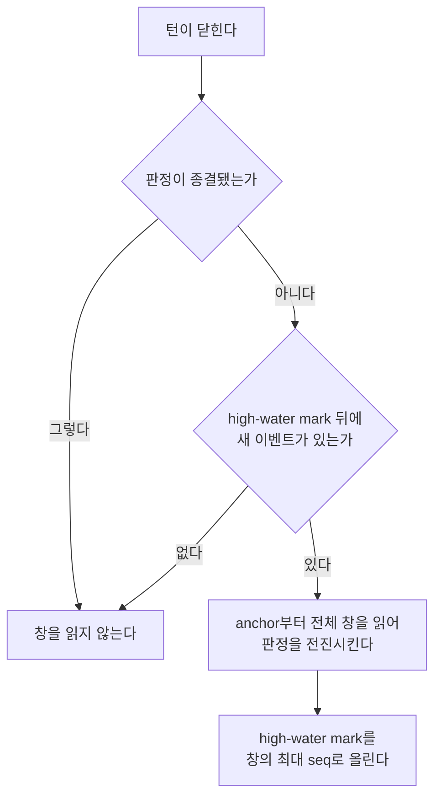

# ADR-0028 — 규칙 판정은 새 이벤트가 있을 때만 창을 다시 읽는다

## 상태

채택됨

## 결정

판정은 마지막으로 전진시킨 창의 끝, 즉 그때까지 본 최대 이벤트 seq를 함께 남긴다.
이 값이 판정의 high-water mark다.

턴이 닫혀 규칙을 판정할 때, 두 경우에는 창을 아예 읽지 않고 건너뛴다. 첫째, 이미 종결된
판정이다. 종결된 판정은 다시 열리지 않으므로 창을 읽어도 결과가 없다. 둘째, 열려 있으나
high-water mark 뒤로 새 이벤트가 없는 판정이다. 창이 그대로면 판정도 그대로다.

그 밖의 경우에만 anchor부터 태스크의 현재 끝까지 전체 창을 읽어 판정을 전진시키고,
그 창의 최대 seq를 high-water mark로 올린다.

## 근거

판정 하나는 anchor부터 태스크의 현재 끝까지를 창으로 삼는다. 턴이 닫힐 때마다 적용 규칙
각각에 대해 이 창을 통째로 다시 읽으면, 비용은 규칙 수 곱하기 anchor 이후 이벤트 수만큼
매 턴 반복된다.

이 반복의 대부분은 아무것도 바꾸지 않는다. 판정의 흔한 종점은 이행 증거를 찾은 satisfied이고,
종결된 판정은 그 뒤로 무슨 이벤트가 와도 다시 열리지 않는다. 그런데도 종결된 판정은 태스크가
사는 내내 매 턴 전체 창을 다시 읽어 같은 결론을 버린다. 열린 판정도, 그 규칙의 창에 새 이벤트가
하나도 붙지 않았다면 다시 읽어봐야 같은 판정이 나온다.

판정을 바꿀 수 있는 것은 창에 붙은 새 이벤트뿐이다. 그러므로 새 이벤트가 없다는 사실을
싸게 확인할 수 있으면 전체 창 읽기를 통째로 아낄 수 있다. high-water mark가 그 사실이다.
창 끝의 최대 seq 하나를 비교하는 것으로 "그 뒤로 새 이벤트가 있는가"를 판단한다.

## 재빌드 가능성

판정은 원장에서 다시 만들어낼 수 있는 투영이고, high-water mark도 그 성질을 깨지 않는다.
재생은 원장을 seq 순서로 흘리며 턴을 차례로 닫고, 그때마다 판정을 전진시킨다. high-water
mark는 매 전진에서 그 시점 창의 최대 seq로 결정되므로, 같은 원장을 재생하면 같은 값이 채워진다.
사람이 넣는 값이 아니라 창에서 파생되는 값이다.

건너뛰기는 판정 결과를 바꾸지 않는다. 종결된 판정은 원래도 전진하지 않았고, 새 이벤트 없는
열린 판정은 다시 읽어도 같은 창이라 같은 상태를 낸다. 그래서 재생 결과는 최적화 전과 같다.

## 판정 단조성

건너뛰기가 안전한 근거는 판정이 창의 성장에 대해 단조라는 데 있다. 창은 이벤트가 붙어
커지기만 한다. 이행 증거도, 분류하지 못한 관측도 창이 커지면 늘기만 하고 줄지 않는다.
그리고 종결은 되돌지 않는다. 이행 증거를 찾으면 satisfied로 굳고, 창을 빠짐없이 보고도
증거가 없으면 열린 채 남으며, 관측이 불완전하면 unknown으로 굳는다.

이 단조성 덕분에 "새 이벤트가 없다"는 곧 "판정이 바뀔 여지가 없다"와 같다. high-water mark
뒤로 이벤트가 없으면 창은 지난번과 동일하고, 동일한 창은 동일한 판정을 낸다.

## 대안

**창 조각만 읽어 증거를 누적하는 증분 재판정.** high-water mark 뒤 구간만 읽어, 저장된 증거에
새 도구 호출을 이어 붙여 전진시키는 방법이다. 열린 판정도 전체 창을 읽지 않는다.

택하지 않았다. 판정의 증거에는 규칙을 낳은 발화와 이행 도구 호출을 언제 그렇게 판정했는지가
남는데, 전체 창을 읽는 현재 방식은 전진할 때마다 이 시각을 그 순간으로 다시 찍는다. 조각만
누적하면 옛 증거의 시각이 처음 판정한 시각으로 굳어, 전체 창을 읽은 결과와 증거가 갈린다.
판정 상태는 같아도 증거가 달라진다. 정확성을 성능보다 앞에 두므로, 판정을 바꿀 수 없는
읽기만 건너뛰고 실제 판정은 지금처럼 전체 창으로 계산한다.

## 결과

- 종결된 판정은 태스크가 사는 내내 창을 한 번도 다시 읽지 않는다.
- 열린 판정은 그 규칙의 창에 새 이벤트가 붙은 턴에만 전체 창을 읽는다.
- 판정 결과와 증거는 최적화 전과 같고, 재생 결과도 같다.
- 판정에 마지막으로 본 창 끝이 남아, 다음 전진이 어디서부터 볼 필요가 있는지 판단한다.
