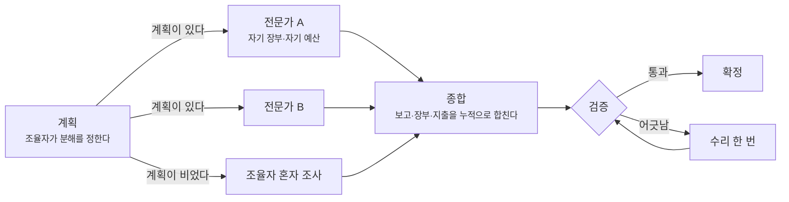

# ADR-0032 — 조율자가 전문가를 띄우되 분해는 모델이 정한다

## 상태

채택됨

## 결정

파이썬 실행 백엔드는 조사를 조율자 하나와 전문가 여럿으로 나눈다. 조율자가 무엇을 누구에게
맡길지 정하고, 전문가는 각자 자기 맥락에서 조사한 뒤 판정과 발췌를 올리고, 조율자가 그것으로
최종 출력을 쓴다.

**분해의 결정권은 그래프가 아니라 모델에 있다.** 어느 전문가를 띄울지, 무엇을 묻고 몇 라운드를
줄지를 조율자가 정한다. 그래프는 그 결정을 실행할 뿐 순서를 미리 정하지 않는다.

전문가는 노드로 편다. 도구 뒤에 숨기지 않는다.

분해는 이 배포 단위 안에만 있다. 도구 집합과 출력 계약과 검증 규칙은 바뀌지 않으므로 다른
실행 백엔드는 단일 루프로 남는다.

## 근거

에이전트를 여럿 두는 것과 에이전틱한 것은 다르다. 저자가 배선한 전문가 릴레이는 에이전트가
여럿이지만 누가 언제 도는지를 사람이 정한 파이프라인이고, 인계마다 맥락이 깎이고 앞 단계의
착오가 뒤로 누적된다. 재량이 늘어나려면 **분해를 모델이 결정해야** 한다.

전문가를 도구 뒤에 숨기지 않는 이유는 관측이다. 이 백엔드의 궤적은 노드 진입과 분기 선택을
남긴다. 분해를 도구 호출로 감싸면 그 전부가 노드 하나 안에 들어가 무엇이 몇 초 걸렸는지,
조율자가 무엇을 건너뛰었는지가 사라진다. 실행 방식의 차이를 재려는데 그 차이가 안 보이면
분해할 이유가 없다.

나누는 축은 **단계가 아니라 근거의 출처**다. 조사·판별·작성으로 나누면 앞 단계가 뒤 단계에서
무엇이 필요할지 모르는 채 요약해 넘기고, 그 손실은 복구되지 않는다. 출처로 나누면 전문가마다
볼 것이 실제로 다르고 서로를 기다리지 않는다.

전부를 나누지는 않는다. 입력이 한 페이지뿐이고 병렬로 쪼갤 것이 없는 조사는 나누면 통신
비용만 남는다. 나누지 않은 것이 하나 있어야 나눈 것이 이득인지도 잴 수 있다.

## 구현

### 형태

**계획 → 팬아웃 → 종합**이 앞에 붙고, 뒤의 검증과 한 번의 수리는 그대로다.

계획 노드는 조사에 앞서 한 번 돈다. 계획이 비면 전문가를 띄우지 않고 조율자가 혼자 조사한다.
이 경로가 남아 있어야 분해가 이득이 아닌 실행에서 분해를 강요하지 않는다.

### 예산

조율자가 전문가별 라운드를 정한다. 요구가 남은 예산을 넘으면 실행을 실패시키지 않고 비례로
줄이며, 전문가마다 최소 한 라운드는 남긴다. 줄인 사실은 궤적에 남는다. 몫을 나눈 나머지는
많이 요구한 쪽에 돌려주어 예산을 흘리지 않는다.

비용도 계획 비율대로 잘라 전문가마다 자기 한도를 준다. 하나의 한도를 여럿이 나눠 쓰면 병렬
실행에서 집행 시점이 서로 겹친다.

계획과 조사에 쓰고 남은 라운드가 종합의 몫이다. 고정값을 두면 전문가를 적게 띄운 실행에서
예산이 놀게 된다.

### 근거 장부

전문가는 자기 장부로 조사한다. 다른 전문가가 읽은 것을 인용하지 못하게 하기 위해서다.
보고가 올라올 때 장부를 합치고, 조율자는 합쳐진 장부가 허용하는 것만 인용한다.

병렬 분기가 같은 상태 칸에 쓰므로 보고와 장부와 지출은 모두 누적으로 합친다. 합치지 않으면
마지막 분기만 남아 인용이 무너지고 지출이 실제보다 작게 잡힌다.

### 보고

전문가는 판정과 발췌와 관측한 식별자를 올린다. 조율자가 최종 문장을 쓰므로 요약만으로는
부족하고 원문 조각이 필요하다.

**발췌에는 상한을 둔다.** 상한이 곧 격리의 강도다. 넉넉히 열면 격리했던 맥락이 조율자에게
그대로 옮겨와 나눈 의미가 사라진다.

예산이 끊겨 답을 못 낸 전문가는 그 사실을 보고에 싣는다. 조율자가 남은 예산을 다시 줄지
판단하려면 그것을 알아야 한다. 조사 도중 무너진 전문가도 같다. 예외를 병렬 분기 밖으로
던지면 같은 시점에 도는 다른 전문가의 성과까지 함께 버려지므로, 무너진 전문가는 실패
사실을 판정에 담아 보고로 올리고 나머지 보고는 그대로 합쳐진다.

## 결과

- 전문가를 더하거나 빼도 도구 집합의 합집합이 그대로면 계약은 손대지 않는다.
- 조율자가 아무도 띄우지 않기로 하면 단일 루프와 같은 실행이 된다. 그것도 옳은 결정이다.
- 전문가가 읽은 것을 조율자가 인용하려면 장부가 합쳐져야 한다. 합치는 자리를 빠뜨리면
  검증기가 조율자의 인용을 전부 거부한다.
- 계획을 세우는 호출이 첫 모델 호출이므로 모델 실패도 그 자리에서 궤적에 남는다.
- 발췌 상한과 라운드 배분은 실행을 관찰해 정하는 값이다. 값이 바뀌면 격리의 강도와 종합의
  여유가 함께 바뀐다.
