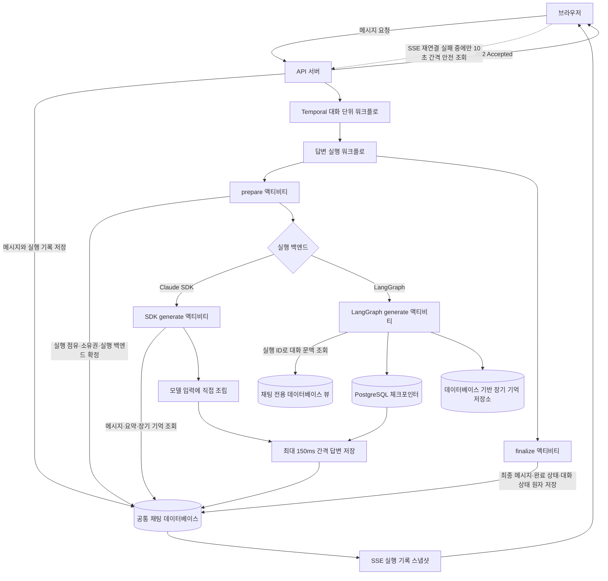

# 채팅 실행 워크플로

채팅 실행은 브라우저 연결과 분리된 Temporal 워크플로가 소유한다. API는 사용자 메시지와 `queued`
실행 기록을 데이터베이스에 저장한 뒤 `202 Accepted`로 즉시 응답한다. 같은 대화의 실행은 대화 단위
워크플로가 요청 순서대로 하나씩 처리한다.

## 공통 단계

`prepare`는 실행을 `running`으로 점유하고 사용자 소유권, 실행 백엔드, 모델, 언어만 확정한다.
메시지, 요약, 장기 기억은 읽지 않는다. `finalize`는 최종 어시스턴트 메시지, 실행 완료 상태,
대화 상태를 하나의 트랜잭션으로 저장한다. 두 단계는 조건부 상태 변경으로 중복 저장을 막으므로
일시적 오류에 재시도한다.

## Claude SDK 기억

SDK 생성 경로는 API 서버 저장소에서 같은 대화의 메시지와 요약, 사용자의 장기 기억을 읽는다.
요약이 있으면 최근 메시지와 함께 모델 입력에 직접 조립한다. 새 장기 기억도 API 서버 저장소를
통해 공통 채팅 데이터베이스에 기록한다.

## LangGraph 기억

LangGraph 요청에는 전체 대화 대신 실행 ID, 대화 ID, 사용자 ID를 전달한다. Python 에이전트는 채팅
전용 데이터베이스 뷰에서 메시지와 요약을 직접 복원한다. 복원한 기록은 실행 ID를 키로 하는
PostgreSQL 체크포인터에 넣어 워커가 재시작되어도 모델·도구 호출 진행 상태를 유지한다. 장기 기억은
LangGraph `BaseStore` 구현이 SDK와 같은 사용자 기억 테이블을 직접 읽고 쓴다.

대화 내용의 기준 데이터는 공통 채팅 데이터베이스에 저장하며 체크포인트는 LangGraph 내부 실행
상태만 소유한다. 따라서 SDK에서 LangGraph로 바꾸면 LangGraph가 공통 채팅 데이터베이스의 SDK
답변까지 복원하고, LangGraph에서 SDK로 바꾸면 SDK가 공통 채팅 데이터베이스의 LangGraph 답변까지
모델 입력에 조립한다.

## 재시도와 화면 복구

유료 모델 호출은 성공 여부가 불명확할 때 같은 요청을 반복하면 중복 과금될 수 있어 자동
재시도하지 않는다. 화면 연결은 모델 실행과 별개다. 새로고침하면 데이터베이스에 저장된 답변을
먼저 보여 주고 SSE를 다시 연결한다. SSE가 계속 실패할 때만 10초마다 데이터베이스를 조회한다.
