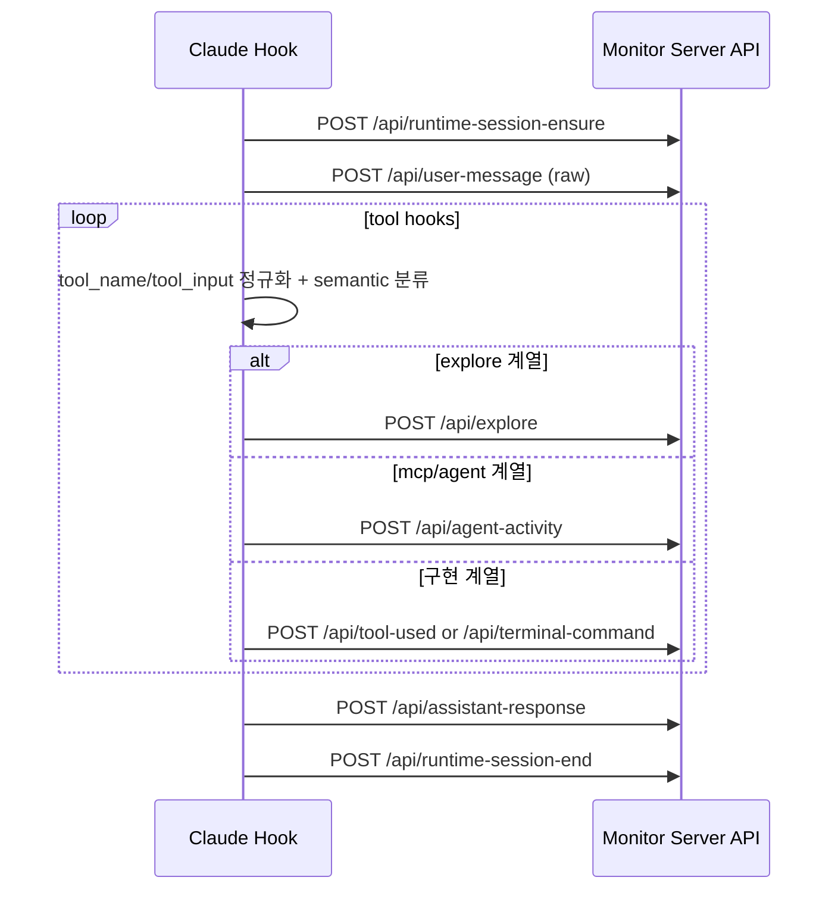
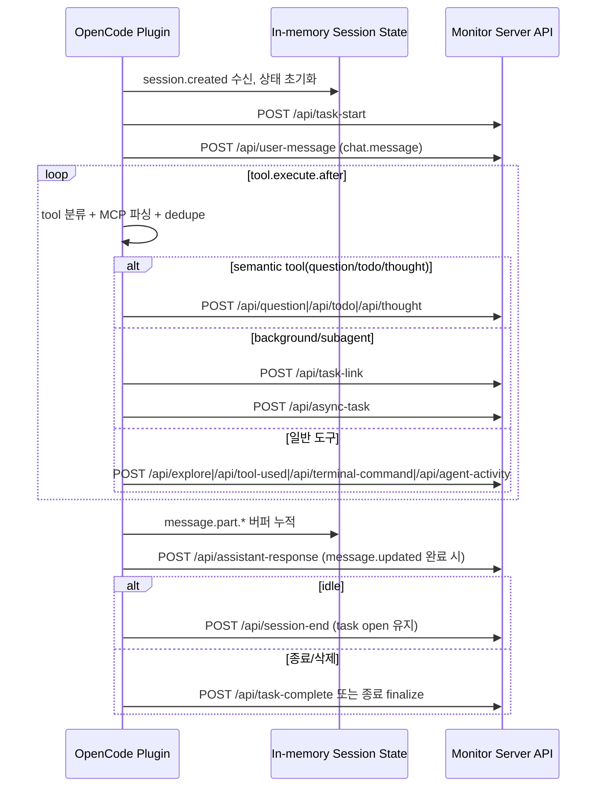
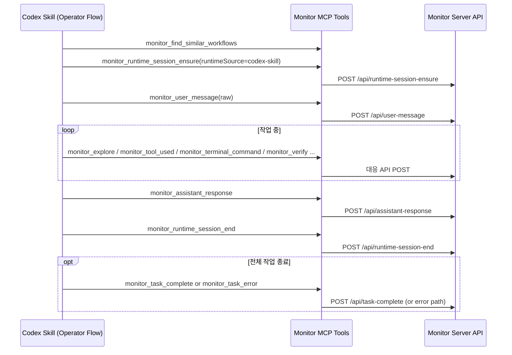

# Runtime API Flow & Preprocessing (Claude Code / OpenCode / Codex)

세 런타임(Claude Code, OpenCode, Codex)이 Agent Tracer API를 호출하기 전에 어떤 **전처리/정규화**를 수행하고,
어떤 **API 역할**을 어떤 순서로 사용하는지 한 문서에서 비교할 수 있는 운영 레퍼런스다.

- 구현 근거:
  - Claude hooks: `.claude/hooks/*.ts`
  - OpenCode plugin: `.opencode/plugins/monitor.ts`
  - Codex skill: `.agents/skills/codex-monitor/SKILL.md`
- 함께 보면 좋은 문서:
  - [API integration map](./api-integration-map.md)
  - [Claude hook payload spec](./hook-payload-spec.md)

---

## 1) API 역할 카탈로그 (무엇을 저장하는가)

| API | 핵심 역할 | 대표 저장 데이터 |
|---|---|---|
| `/api/runtime-session-ensure` | 런타임 세션 upsert + task/session 바인딩 | `runtimeSource`, `runtimeSessionId`, `workspacePath` |
| `/api/task-start` | task/session 명시 생성 | `taskId`, `title`, `taskKind`, parent linkage |
| `/api/runtime-session-end` | runtime session 종료(+선택 task complete) | `completeTask`, `completionReason` |
| `/api/session-end` | task는 유지하고 session만 종료 | `summary`, `status` |
| `/api/task-complete` | task 단위 완전 종료 | `summary`, `status` |
| `/api/user-message` | 사용자 raw prompt 저장 | `captureMode`, `source`, `phase`, `title/body` |
| `/api/assistant-response` | assistant 최종 응답 저장 | `messageId`, `source`, `title/body`, token metadata |
| `/api/tool-used` | 구현 행위 기록 | `toolName`, `lane`, `filePaths`, semantic metadata |
| `/api/explore` | 탐색/조회 행위 기록 | 탐색 도구명, 대상 경로/쿼리, web lookup metadata |
| `/api/terminal-command` | shell 실행 기록 | command, lane, semantic subtype |
| `/api/agent-activity` | skill/delegation/MCP 호출 기록 | `activityType`, agent/skill/mcp metadata |
| `/api/todo` | todo lifecycle 추적 | `todoId`, `todoState`, sequence |
| `/api/question` | 질문 asked/answered 흐름 기록 | `questionId`, `questionPhase`, `title/body` |
| `/api/thought` | 요약형 reasoning 기록 | title/body + 모델 메타 |
| `/api/task-link` | parent-child task 연결 | parentTask/session linkage |
| `/api/async-task` | 백그라운드 task 상태 | `asyncTaskId`, `asyncStatus` |
| `/api/plan`, `/api/action`, `/api/verify`, `/api/rule`, `/api/save-context` | 수동/스킬 경로의 고신호 구조화 이벤트 | planning/execution/verification/rule/context snapshot |

---

## 2) 런타임별 전처리(처리/정규화) 전략

### Claude Code (hook)

**입력 정규화**
- hook stdin JSON을 읽어 object가 아니면 빈 객체로 처리.
- `hook_source`가 `claude-hook`이 아닌 경우 세션 식별을 폐기해 오염 이벤트를 차단.
- 문자열은 trim + maxLength 컷오프로 정규화 (`toTrimmedString`).

**세션 선행 보장**
- `SessionStart`, `UserPromptSubmit`, `PreToolUse` 계열에서 `runtime-session-ensure`를 먼저 호출.
- user prompt는 `/exit` 같은 종료 커맨드를 필터링 후 `/api/user-message` 저장.

**도구 이벤트 분류/강화**
- `tool_name`과 `tool_input`을 보고 `/api/tool-used` vs `/api/agent-activity`로 라우팅.
- MCP 형식 도구(`mcp__...`)는 `activityType: "mcp_call"`로 변환.
- Bash는 command 의미 분류(탐색/검증/빌드 등) 후 semantic metadata를 보강.
- Explore 도구(Read/Glob/Grep/WebSearch/WebFetch)는 title/body/filePaths/webUrls를 표준화해 `/api/explore`로 저장.

### OpenCode (plugin)

**입력 정규화 + 안전성**
- 모든 API POST는 실패 시 null 반환(비차단)으로 처리하여 에이전트 실행을 방해하지 않음.
- 문자열/객체 변환 헬퍼(`toNonEmptyString`, `asObject`)로 입력 타입 흔들림을 완충.
- payload 로그는 긴 문자열을 truncate해 dev log 크기 폭증을 방지.

**세션 상태 머신**
- `session.created`에서 task-start 기반 상태 초기화.
- `sessionStates`, `pendingSessionStarts`, `suspendedSessionStates`, `endedSessionIds`로 중복/경합을 억제.
- `seenMessageIds`, `seenToolCallIds`, `seenCompletionMessageIds`로 중복 기록을 차단.

**도구 분류 + 시맨틱 라우팅**
- 도구명에서 MCP server/tool 파싱(`mcp__server__tool`, 설정 기반 prefix, fallback heuristics).
- `tool.execute.after`에서 우선순위:
  1) TodoWrite 전용 전이 로깅
  2) monitor_question/monitor_todo/monitor_thought/native question 시맨틱 라우팅
  3) 일반 도구 분류(`/api/tool-used`, `/api/explore`, `/api/terminal-command`, `/api/agent-activity`)
- background/subagent는 `pendingBackgroundLinks` + `/api/task-link` + `/api/async-task`로 lineage를 보정.

**assistant 응답 조립**
- `message.part.*` delta를 버퍼링하고 `message.updated` completion 시 최종 텍스트를 조립.
- 조립 결과를 `/api/assistant-response` 저장 후, 세션 finalize 정책(`idle`, `assistant_turn_complete`, `runtime_terminated`)에 따라 `/api/session-end` 또는 `/api/task-complete` 경로로 종료.

### Codex (skill + MCP)

**핵심 원칙: 수동이지만 일관성 높은 절차**
- 시작 전에 유사 워크플로우 검색(`monitor_find_similar_workflows`).
- `runtimeSessionId`를 thread/topic 단위로 고정(`CODEX_THREAD_ID` 우선).
- 반드시 `monitor_runtime_session_ensure` 성공 후 taskId/sessionId 필요한 호출 수행.
- raw prompt는 `monitor_user_message(captureMode="raw")`로 기록.
- 답변 직전에 `monitor_assistant_response`, 직후 `monitor_runtime_session_end`.
- thread 전체 종료 시에만 `monitor_task_complete`/`monitor_task_error`.

**전처리 포인트(실행자 책임)**
- phase(initial/follow_up), lane, summary/title/body, verification 결과를 호출자가 명시적으로 정규화해서 전달.
- placeholder taskId 금지(`pending` 금지), ensure 실패 시 동일 runtimeSessionId로 재시도.

---


## 3) 실제 JSON 예시 (전처리 결과 샘플)

아래는 "입력(raw signal) → API 요청 바디"가 어떻게 정규화되는지 보여주는 대표 예시다.
실제 값(`taskId`, `sessionId`, `messageId`)은 런타임/턴마다 달라진다.

### Claude Code hook 예시

**A. `UserPromptSubmit` → `/api/user-message`**

```json
{
  "taskId": "task_01J...",
  "sessionId": "sess_01J...",
  "messageId": "msg_1712345678901_ab12cd",
  "captureMode": "raw",
  "source": "claude-hook",
  "title": "문서 구조를 정리하고 API 흐름도도 추가해줘",
  "body": "문서 구조를 정리하고 API 흐름도도 추가해줘"
}
```

**B. `PostToolUse(Bash)` → `/api/terminal-command`**

```json
{
  "taskId": "task_01J...",
  "sessionId": "sess_01J...",
  "command": "npm test",
  "title": "npm test",
  "body": "npm test",
  "lane": "implementation",
  "metadata": {
    "description": "",
    "command": "npm test",
    "subtypeKey": "run_test",
    "subtypeLabel": "Run test",
    "subtypeGroup": "execution",
    "toolFamily": "terminal",
    "operation": "execute",
    "entityType": "command",
    "entityName": "npm",
    "sourceTool": "Bash"
  }
}
```

**C. `Stop` → `/api/assistant-response` + `/api/runtime-session-end`**

```json
{
  "taskId": "task_01J...",
  "sessionId": "sess_01J...",
  "messageId": "msg_1712345678999_f3e2aa",
  "source": "claude-hook",
  "title": "요청하신 문서를 갱신했고 각 런타임별 예시를 추가했습니다.",
  "body": "요청하신 문서를 갱신했고 각 런타임별 예시를 추가했습니다.",
  "metadata": {
    "stopReason": "end_turn",
    "inputTokens": 1200,
    "outputTokens": 430
  }
}
```

```json
{
  "runtimeSource": "claude-hook",
  "runtimeSessionId": "claude-session-abc",
  "completeTask": true,
  "completionReason": "assistant_turn_complete",
  "summary": "요청하신 문서를 갱신했고 각 런타임별 예시를 추가했습니다."
}
```

### OpenCode plugin 예시

**A. `session.created` 후 상태 확정 → `/api/task-start`**

```json
{
  "taskId": "opencode:session_abc123",
  "title": "OpenCode - agent-tracer",
  "workspacePath": "/workspace/agent-tracer",
  "runtimeSource": "opencode-plugin",
  "taskKind": "primary",
  "metadata": {
    "opencodeSessionId": "session_abc123",
    "opencodeSessionTitle": "Agent Tracer"
  }
}
```

**B. `chat.message` → `/api/user-message`**

```json
{
  "taskId": "task_01J...",
  "sessionId": "sess_01J...",
  "messageId": "msg_open_123",
  "captureMode": "raw",
  "source": "opencode-plugin",
  "phase": "initial",
  "title": "api 흐름을 문서로 정리해줘",
  "body": "api 흐름을 문서로 정리해줘",
  "metadata": {
    "modelId": "gpt-5",
    "providerId": "openai",
    "opencodeSessionId": "session_abc123"
  }
}
```

**C. `message.updated` 완료 → `/api/assistant-response`**

```json
{
  "taskId": "task_01J...",
  "sessionId": "sess_01J...",
  "messageId": "assistant_msg_77",
  "source": "opencode-plugin",
  "title": "요청하신 문서에 JSON 예시와 Mermaid 흐름을 추가했습니다.",
  "body": "요청하신 문서에 JSON 예시와 Mermaid 흐름을 추가했습니다.",
  "metadata": {
    "stopReason": "stop",
    "inputTokens": 980,
    "outputTokens": 510,
    "cacheReadTokens": 400
  }
}
```

**D. background/subagent 연결 → `/api/task-link` + `/api/async-task`**

```json
{
  "taskId": "task_child_01J...",
  "taskKind": "background",
  "parentTaskId": "task_parent_01J...",
  "parentSessionId": "sess_parent_01J...",
  "title": "Subagent: docs refresh"
}
```

```json
{
  "taskId": "task_parent_01J...",
  "sessionId": "sess_parent_01J...",
  "asyncTaskId": "background_task_42",
  "asyncStatus": "running",
  "title": "Background task launched",
  "parentSessionId": "sess_parent_01J...",
  "metadata": {
    "opencodeSessionId": "session_abc123",
    "childSessionId": "session_child_999"
  }
}
```

### Codex skill + MCP 예시

Codex는 hook/plugin 자동 전처리 대신, 호출 순서와 필드 품질을 **실행자(스킬 절차)**가 보장한다.

**A. `monitor_runtime_session_ensure`가 만드는 서버 요청 (`/api/runtime-session-ensure`)**

```json
{
  "runtimeSource": "codex-skill",
  "runtimeSessionId": "codex-thread-7f1d...",
  "title": "Codex - agent-tracer",
  "workspacePath": "/workspace/agent-tracer"
}
```

**B. `monitor_user_message`가 만드는 서버 요청 (`/api/user-message`)**

```json
{
  "taskId": "task_01J...",
  "sessionId": "sess_01J...",
  "messageId": "msg_codex_001",
  "captureMode": "raw",
  "source": "manual-mcp",
  "phase": "follow_up",
  "title": "각 런타임의 API payload 예시도 문서에 넣어줘",
  "body": "각 런타임의 API payload 예시도 문서에 넣어줘"
}
```

**C. `monitor_assistant_response` + `monitor_runtime_session_end`가 만드는 요청**

```json
{
  "taskId": "task_01J...",
  "sessionId": "sess_01J...",
  "messageId": "assistant_codex_002",
  "source": "manual-mcp",
  "title": "문서를 갱신했습니다.",
  "body": "문서를 갱신했습니다."
}
```

```json
{
  "runtimeSource": "codex-skill",
  "runtimeSessionId": "codex-thread-7f1d...",
  "completionReason": "idle",
  "completeTask": false,
  "summary": "follow-up 가능 상태로 세션 종료"
}
```

### JSON 예시 출처 (코드 기준)

아래 예시는 임의로 만든 스키마가 아니라, 실제 런타임 어댑터 코드의 POST body 필드를 기준으로 정리했다.

| 런타임 | API | 기준 코드 |
|---|---|---|
| Claude hook | `/api/user-message` | `.claude/hooks/user_prompt.ts` |
| Claude hook | `/api/terminal-command` | `.claude/hooks/terminal.ts` |
| Claude hook | `/api/assistant-response`, `/api/runtime-session-end` | `.claude/hooks/stop.ts` |
| OpenCode plugin | `/api/task-start` | `.opencode/plugins/monitor.ts` (`ensureSessionState`) |
| OpenCode plugin | `/api/user-message` | `.opencode/plugins/monitor.ts` (`chat.message`) |
| OpenCode plugin | `/api/assistant-response` | `.opencode/plugins/monitor.ts` (`event: message.updated`) |
| OpenCode plugin | `/api/task-link`, `/api/async-task` | `.opencode/plugins/monitor.ts` (`tool.execute.after`) |
| Codex skill+MCP | `/api/runtime-session-ensure`, `/api/user-message`, `/api/assistant-response`, `/api/runtime-session-end` | `.agents/skills/codex-monitor/SKILL.md` |

> 참고: 실제 런타임에서는 optional field가 조건부로 빠질 수 있으며, 서버의 스키마 검증과 런타임별 guardrail에 따라 일부 값은 자동 보정되거나 생략될 수 있다.

## 4) 요청 흐름 (Mermaid)

### Claude Code hook 흐름



### OpenCode plugin 흐름



### Codex skill + MCP 흐름



---

## 5) 비교 요약 (hook vs plugin vs skill+mcp)

- **Claude hook**: 런타임이 주는 훅 포인트 중심 자동 기록. 세션 ensure가 매우 빠르게 선행되고 도구 이벤트를 가볍게 분류.
- **OpenCode plugin**: hook + typed event를 모두 받아 상태 머신으로 보정/중복제거/백그라운드 lineage 관리까지 수행.
- **Codex skill+mcp**: 자동 훅은 없지만 절차를 강하게 표준화해 고신호 이벤트를 명시적으로 기록.

운영 관점에서는,
- 자동성/복잡도: **OpenCode > Claude > Codex**
- 절차 통제/명시성: **Codex > Claude > OpenCode**

---

## 6) 업데이트 체크리스트

새 API를 추가하거나 의미를 바꿀 때:

1. 이 문서의 **API 역할 카탈로그**를 먼저 업데이트.
2. `docs/guide/api-integration-map.md`의 런타임 매핑 테이블 동기화.
3. 런타임 구현체(Claude hook / OpenCode plugin / Codex skill)의 전처리 규칙 반영.
4. 가능하면 위 Mermaid 흐름도에 분기(alt/opt)까지 함께 반영.
