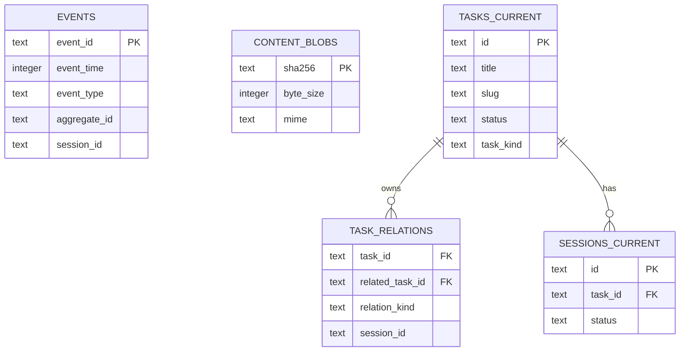
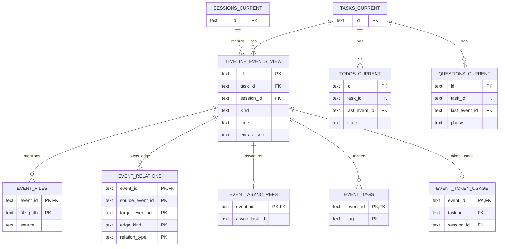
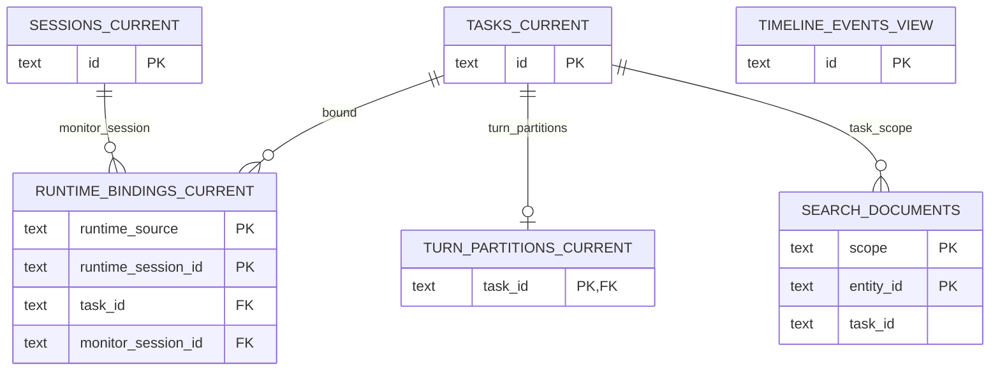
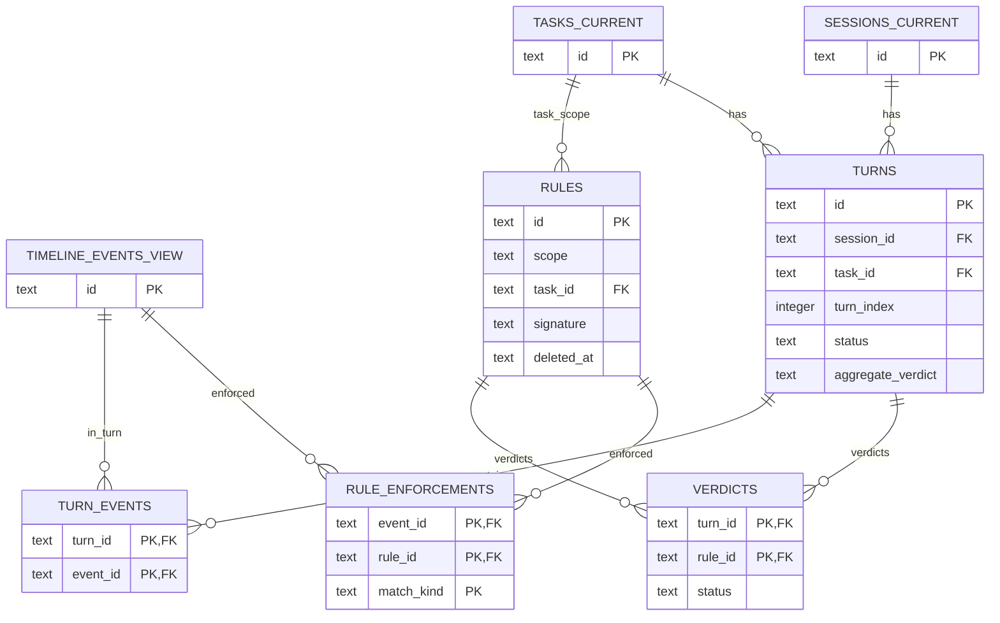

# SQLite Schema

The Agent Tracer server uses SQLite as its OLTP store. New databases are
created directly with the normalized schema described here. There is no
legacy migration path before the first deployment; `runMigrations` is a no-op.

The schema has five major areas:

- Append-only domain events and content blobs.
- Current task/session projections.
- Normalized runtime timeline events.
- Shared search documents and embeddings, plus turn partitions.
- Verification: rules, turns, verdicts, and rule enforcements.

`PRAGMA foreign_keys = ON` is enabled before schema creation. Most child tables
use `on delete cascade`; optional links that should survive parent deletion use
`on delete set null`.

## Table Overview

| Layer | Table | Role |
|---|---|---|
| Event log | `events` | Append-only domain event log |
| Blob store | `content_blobs` | Stores large payloads and body blobs |
| Current state | `tasks_current` | Current task state |
| Current state | `task_relations` | Parent/background/session task links |
| Current state | `sessions_current` | Current session state |
| Timeline | `timeline_events_view` | Runtime timeline event core columns |
| Timeline | `event_files` | Files and paths mentioned by events |
| Timeline | `event_relations` | Explicit event graph edges |
| Timeline | `event_async_refs` | Runtime async task references |
| Timeline | `event_tags` | Runtime/classification tags |
| Timeline | `todos_current` | Current TODO state projected from events |
| Timeline | `questions_current` | Current question state projected from events |
| Timeline | `event_token_usage` | Token, model, cost, and stop metadata |
| Current state | `runtime_bindings_current` | Runtime session bindings |
| Current state | `turn_partitions_current` | Persisted task turn partitions |
| Verification | `rules` | Verification rule definitions (trigger + expect) |
| Verification | `turns` | (user.message → assistant.response) cycles per session |
| Verification | `turn_events` | Link table: events that belong to a turn |
| Verification | `verdicts` | Per-turn × per-rule definitive evaluation result |
| Verification | `rule_enforcements` | Per-event × per-rule overlay (trigger / expect-fulfilled) |
| Search index | `search_documents` | Search and embedding index for tasks and events |

## Relationship Diagrams

### Diagram 1 — Task & Session Core

Event log, content blobs, and the task/session projection tables.



### Diagram 2 — Timeline Events

Timeline event core table and all normalized detail tables.
`TASKS_CURRENT` and `SESSIONS_CURRENT` are shown as reference nodes.



### Diagram 3 — Runtime, Search & Auxiliary

Runtime bindings, turn partitions, and the shared search index.
`TASKS_CURRENT`, `SESSIONS_CURRENT`, and `TIMELINE_EVENTS_VIEW` are shown as
reference nodes.



### Diagram 4 — Verification

Rule definitions, turn entities, per-turn verdicts, and per-event rule
enforcements. `TASKS_CURRENT`, `SESSIONS_CURRENT`, and `TIMELINE_EVENTS_VIEW`
are reference nodes.



## Compatibility Notes

`timeline_events_view` is still named as a view-style table for API and query
compatibility, but it now stores only event core columns plus semantic columns
and `extras_json`. The old `metadata_json` and `classification_json` columns are
not present for timeline events.

The repository read path reconstructs the public `TimelineEvent.metadata` shape
from normalized tables:

- semantic columns become `metadata.subtypeKey`, `metadata.toolFamily`, and
  related fields;
- `event_files` becomes `metadata.filePaths`, and the first/relpath value is
  exposed as `metadata.filePath`/`metadata.relPath`;
- `event_relations` becomes `metadata.parentEventId`, `metadata.sourceEventId`,
  `metadata.relatedEventIds`, and `metadata.relationType`;
- `event_tags` becomes `metadata.tags` and `classification.tags`;
- async, rule, verification, TODO, question, and token rows are merged back into
  metadata for existing API consumers.

## Event Log

```sql
create table if not exists events (
  event_id text primary key,
  event_time integer not null,
  event_type text not null,
  schema_ver integer not null,
  aggregate_id text not null,
  session_id text,
  actor text not null,
  correlation_id text,
  causation_id text,
  payload_json text not null,
  recorded_at integer not null
);
```

Indexes:

```sql
create index if not exists idx_events_aggregate_time
  on events(aggregate_id, event_time);

create index if not exists idx_events_type_time
  on events(event_type, event_time);

create index if not exists idx_events_session_time
  on events(session_id, event_time);

create index if not exists idx_events_correlation
  on events(correlation_id);
```

## Content Blobs

```sql
create table if not exists content_blobs (
  sha256 text primary key,
  byte_size integer not null,
  mime text,
  created_at integer not null,
  body blob not null
);
```

## Task And Session Projections

`tasks_current` stores only task core state. Task hierarchy and background links
are stored in `task_relations`.

```sql
create table if not exists tasks_current (
  id text primary key,
  title text not null,
  slug text not null,
  workspace_path text,
  status text not null,
  task_kind text not null default 'primary',
  created_at text not null,
  updated_at text not null,
  last_session_started_at text,
  cli_source text
);

create table if not exists task_relations (
  task_id text not null references tasks_current(id) on delete cascade,
  related_task_id text references tasks_current(id) on delete cascade,
  relation_kind text not null check(relation_kind in ('parent','background','spawned_by_session')),
  session_id text,
  check (
    (relation_kind in ('parent','background') and related_task_id is not null and session_id is null)
    or
    (relation_kind = 'spawned_by_session' and related_task_id is null and session_id is not null)
  )
);

create table if not exists sessions_current (
  id text primary key,
  task_id text not null,
  status text not null,
  summary text,
  started_at text not null,
  ended_at text
);
```

Indexes:

```sql
create index if not exists idx_tasks_current_updated
  on tasks_current(updated_at desc);

create unique index if not exists idx_task_relations_task_related
  on task_relations(task_id, relation_kind, related_task_id)
  where related_task_id is not null;

create unique index if not exists idx_task_relations_task_session
  on task_relations(task_id, relation_kind, session_id)
  where session_id is not null;

create index if not exists idx_task_relations_related
  on task_relations(related_task_id, relation_kind);

create index if not exists idx_sessions_current_task_started
  on sessions_current(task_id, started_at);

create index if not exists idx_sessions_current_task_status_started
  on sessions_current(task_id, status, started_at desc);
```

`task_relations.relation_kind` has these meanings:

| Kind | Columns | Meaning |
|---|---|---|
| `parent` | `related_task_id` | This task is a child of another task |
| `background` | `related_task_id` | This task belongs to a background root task |
| `spawned_by_session` | `session_id` | This task was spawned from a monitor session |

## Timeline Events

`timeline_events_view` stores event identity, display fields, and promoted
semantic fields. Residual, non-promoted metadata is stored in `extras_json`.

```sql
create table if not exists timeline_events_view (
  id text primary key,
  task_id text not null references tasks_current(id) on delete cascade,
  session_id text references sessions_current(id) on delete set null,
  kind text not null,
  lane text not null,
  title text not null,
  body text,
  subtype_key text,
  subtype_label text,
  subtype_group text,
  tool_family text,
  operation text,
  source_tool text,
  tool_name text,
  entity_type text,
  entity_name text,
  display_title text,
  evidence_level text,
  extras_json text not null default '{}',
  created_at text not null
);
```

Indexes:

```sql
create index if not exists idx_timeline_events_view_task_created
  on timeline_events_view(task_id, created_at);

create index if not exists idx_timeline_events_subtype_group
  on timeline_events_view(subtype_group, created_at);

create index if not exists idx_timeline_events_tool_family
  on timeline_events_view(tool_family);

create index if not exists idx_timeline_events_lane_created
  on timeline_events_view(lane, created_at);
```

## Timeline Detail Tables

The following tables replace the previous timeline metadata god-blob.

```sql
create table if not exists event_files (
  event_id text not null references timeline_events_view(id) on delete cascade,
  file_path text not null,
  source text not null default 'metadata' check(source in ('metadata','command_analysis','runtime_relpath','multiple')),
  write_count integer not null default 0,
  primary key (event_id, file_path)
);

create table if not exists event_relations (
  event_id text not null references timeline_events_view(id) on delete cascade,
  source_event_id text not null,
  target_event_id text not null,
  edge_kind text not null check(edge_kind in ('parent','source','related')),
  relation_type text not null default 'relates_to'
    check(relation_type in ('implements','revises','verifies','answers','delegates','returns','completes','blocks','caused_by','relates_to')),
  relation_label text,
  relation_explanation text,
  primary key (event_id, source_event_id, target_event_id, edge_kind, relation_type)
);

create table if not exists event_async_refs (
  event_id text primary key references timeline_events_view(id) on delete cascade,
  async_task_id text not null,
  async_status text,
  async_agent text,
  async_category text,
  duration_ms integer
);

create table if not exists event_tags (
  event_id text not null references timeline_events_view(id) on delete cascade,
  tag text not null,
  source text not null default 'metadata' check(source in ('metadata','classification','multiple')),
  primary key (event_id, tag)
);
```

`event_relations.edge_kind` records structural origin (`parent`, `source`, or
`related`). `event_relations.relation_type` preserves the semantic relation
(`implements`, `verifies`, `caused_by`, and so on).

```sql
create table if not exists todos_current (
  id text primary key,
  task_id text not null references tasks_current(id) on delete cascade,
  title text not null,
  state text not null check(state in ('added','in_progress','completed','cancelled')),
  priority text,
  auto_reconciled integer not null default 0,
  last_event_id text references timeline_events_view(id) on delete set null,
  created_at text not null,
  updated_at text not null
);

create table if not exists questions_current (
  id text primary key,
  task_id text not null references tasks_current(id) on delete cascade,
  title text not null,
  phase text not null check(phase in ('asked','answered','concluded')),
  sequence integer,
  model_name text,
  model_provider text,
  last_event_id text references timeline_events_view(id) on delete set null,
  created_at text not null,
  updated_at text not null
);

create table if not exists event_token_usage (
  event_id text primary key references timeline_events_view(id) on delete cascade,
  session_id text references sessions_current(id) on delete set null,
  task_id text not null references tasks_current(id) on delete cascade,
  input_tokens integer not null default 0,
  output_tokens integer not null default 0,
  cache_read_tokens integer not null default 0,
  cache_create_tokens integer not null default 0,
  cost_usd real,
  duration_ms integer,
  model text,
  prompt_id text,
  stop_reason text,
  occurred_at text not null
);
```

Detail indexes:

```sql
create index if not exists idx_event_files_path on event_files(file_path);
create index if not exists idx_event_files_event on event_files(event_id);
create index if not exists idx_event_relations_source on event_relations(source_event_id);
create index if not exists idx_event_relations_target on event_relations(target_event_id);
create index if not exists idx_event_async_refs_task on event_async_refs(async_task_id);
create index if not exists idx_event_tags_tag on event_tags(tag);
create index if not exists idx_todos_task_state on todos_current(task_id, state);
create index if not exists idx_questions_task_phase on questions_current(task_id, phase);
create index if not exists idx_event_token_usage_session on event_token_usage(session_id, occurred_at);
create index if not exists idx_event_token_usage_model on event_token_usage(model);
create index if not exists idx_event_token_usage_task on event_token_usage(task_id, occurred_at);
```

## Runtime Bindings

```sql
create table if not exists runtime_bindings_current (
  runtime_source text not null,
  runtime_session_id text not null,
  task_id text not null references tasks_current(id) on delete cascade,
  monitor_session_id text references sessions_current(id) on delete set null,
  created_at text not null,
  updated_at text not null,
  primary key (runtime_source, runtime_session_id)
);
```

## Search Documents

`search_documents` is the shared lexical and embedding index across tasks and
timeline events.

```sql
create table if not exists search_documents (
  scope text not null check(scope in ('task', 'event')),
  entity_id text not null,
  task_id text,
  search_text text not null,
  embedding text,
  embedding_model text,
  updated_at text not null,
  primary key (scope, entity_id)
);
```

| Scope | Entity id |
|---|---|
| `task` | Task id |
| `event` | Timeline event id |

Indexes:

```sql
create index if not exists idx_search_documents_scope_task_updated
  on search_documents(scope, task_id, updated_at desc);
```

## Turn Partitions

```sql
create table if not exists turn_partitions_current (
  task_id text primary key references tasks_current(id) on delete cascade,
  groups_json text not null,
  version integer not null default 1,
  updated_at text not null
);
```

## Verification

Verification rules evaluate `(user.message → assistant.response)` cycles
("turns") for fact-checking what the agent claimed against what it actually
did. The evaluation workflow is implemented in
`packages/server/src/application/verification/services/`.

There are two evaluation surfaces:

- **Event post-processing overlay**: every logged event in an open turn is matched
  against active rules. Matches write `rule_enforcements` and broadcast
  `rule_enforcement.added`, allowing clients to move those events into the
  rule lane immediately.
- **Definitive turn verdict**: verdicts are computed when a turn closes. The
  server writes `verdicts`, updates `turns.aggregate_verdict`, and broadcasts
  `verdict.updated`.

When a new rule is created or activated, backfill evaluates the new rule
against both closed turns and currently open turns in scope. Closed turns get
both enforcements and verdicts; open turns get only enforcements until they
close.

### `rules` — verification rule definitions

```sql
create table if not exists rules (
  id text primary key,
  name text not null,
  trigger_phrases_json text,
  trigger_on text check(trigger_on in ('user','assistant')),
  expect_tool text,
  expect_command_matches_json text,
  expect_pattern text,
  scope text not null check(scope in ('global','task')),
  task_id text references tasks_current(id) on delete cascade,
  source text not null check(source in ('human','agent')),
  severity text not null check(severity in ('info','warn','block')),
  rationale text,
  signature text not null,
  created_at text not null,
  deleted_at text,
  check (
    (scope = 'global' and task_id is null)
    or (scope = 'task' and task_id is not null)
  )
);
```

- `signature` = stable hash of `(trigger_phrases, trigger_on, expect_tool,
  expect_command_matches, expect_pattern)`. When signature changes on update,
  past verdicts are invalidated. Computed by `computeRuleSignature`.
- `trigger_on` narrows trigger matching to user messages or assistant
  responses. When omitted, both sides of the turn can trigger the rule.
- `deleted_at` = soft-delete tombstone. Active rule queries filter
  `deleted_at IS NULL`. Verdicts and enforcements are preserved as audit
  trail (cascade is from rule HARD delete only).
- `source` distinguishes human-authored rules from agent-suggested ones.

Indexes:

```sql
create index if not exists idx_rules_scope_active on rules(scope) where deleted_at is null;
create index if not exists idx_rules_task_active on rules(task_id) where deleted_at is null;
create index if not exists idx_rules_signature on rules(signature);
```

### `turns` — (user → assistant) cycles per session

```sql
create table if not exists turns (
  id text primary key,
  session_id text not null references sessions_current(id) on delete cascade,
  task_id text not null references tasks_current(id) on delete cascade,
  turn_index integer not null,
  status text not null check(status in ('open','closed')),
  started_at text not null,
  ended_at text,
  asked_text text,
  assistant_text text,
  aggregate_verdict text check(aggregate_verdict in ('verified','contradicted','unverifiable')),
  rules_evaluated_count integer not null default 0
);
```

- `status='open'` between `user.message` and `assistant.response`. Closed by
  `assistant.response`, by a new `user.message` (force-close prior), or by
  `session.ended`.
- `turn_index` is per-session and monotonically increases.
- `aggregate_verdict` cached from worst-priority verdict in `verdicts`
  (contradicted > unverifiable > verified). `null` if no rules evaluated.

Indexes:

```sql
create unique index if not exists idx_turns_session_index on turns(session_id, turn_index);
create index if not exists idx_turns_task_started on turns(task_id, started_at);
create index if not exists idx_turns_session_open on turns(session_id) where status = 'open';
```

### `turn_events` — link table

```sql
create table if not exists turn_events (
  turn_id text not null references turns(id) on delete cascade,
  event_id text not null references timeline_events_view(id) on delete cascade,
  primary key (turn_id, event_id)
);

create index if not exists idx_turn_events_event on turn_events(event_id);
```

Maintained as events arrive while a turn is open. `TurnLifecyclePostProcessor` opens
and closes turns around `user.message` / `assistant.response`; `RuleEnforcementPostProcessor`
links non-user events into the current open turn while it performs per-event
rule matching.

### `verdicts` — definitive (turn × rule) results

```sql
create table if not exists verdicts (
  turn_id text not null references turns(id) on delete cascade,
  rule_id text not null references rules(id) on delete cascade,
  status text not null check(status in ('verified','contradicted','unverifiable')),
  matched_phrase text,
  expected_pattern text,
  actual_tool_calls_json text,
  matched_tool_calls_json text,
  evaluated_at text not null,
  primary key (turn_id, rule_id)
);

create index if not exists idx_verdicts_rule on verdicts(rule_id);
create index if not exists idx_verdicts_status on verdicts(status);
```

- Written by `TurnEvaluator` at turn close (also by `BackfillUseCase` for
  closed turns when a new rule is registered).
- PK `(turn_id, rule_id)` makes evaluation idempotent — reruns UPSERT.
- Detail columns (`matched_phrase`, `expected_pattern`, `*_tool_calls_json`)
  drive the UI's "why this verdict?" explanation.

### `rule_enforcements` — per-event overlay

```sql
create table if not exists rule_enforcements (
  event_id text not null references timeline_events_view(id) on delete cascade,
  rule_id text not null references rules(id) on delete cascade,
  match_kind text not null check(match_kind in ('trigger','expect-fulfilled')),
  decided_at text not null,
  primary key (event_id, rule_id, match_kind)
);

create index if not exists idx_rule_enforcements_rule on rule_enforcements(rule_id);
create index if not exists idx_rule_enforcements_event on rule_enforcements(event_id);
```

- Source for **rule lane reclassification**: when reading
  `timeline_events_view`, the repository LEFT JOINs `rule_enforcements` and
  overrides `lane='rule'` if any row exists for the event.
- `match_kind` distinguishes a triggering match (rule's trigger phrases hit) from
  an expect-fulfillment match (rule's expect tool/command/pattern hit). One
  event can have multiple rows (different rules, or both match kinds for one rule).
- Inserted by `RuleEnforcementPostProcessor` per event, in real time (broadcast as
  `rule_enforcement.added` over WebSocket), and by `BackfillUseCase` when a
  newly registered rule is applied to existing closed or open turn events.

### Verification WebSocket Messages

Verification publishes these realtime messages:

| Message | When | Client effect |
|---|---|---|
| `rule_enforcement.added` | A trigger or expect match is written for an event | Refetch the affected task timeline and reclassify the event into the rule lane |
| `verdict.updated` | A turn closes or a closed turn is backfilled | Refetch task detail and verdict counts |
| `rules.changed` | Rule create/update/delete/promote | Refetch rules; task-scoped changes also refetch that task detail |

## Event Catalog

| Group | Event type |
|---|---|
| Task | `task.created` |
| Task | `task.renamed` |
| Task | `task.status_changed` |
| Task | `task.hierarchy_changed` |
| Session | `session.started` |
| Session | `session.ended` |
| Session | `session.bound` |
| Runtime | `tool.invoked` |
| Runtime | `tool.result` |
| Runtime | `prompt.submitted` |
| Runtime | `completion.received` |
| Runtime | `classification.assigned` |
| Curation | `turn.partition_updated` |
| Curation | `turn.partition_reset` |

## Event Store API

| API | Return / effect |
|---|---|
| `append(event)` | Appends a domain event to `events` and updates projections |
| `readAggregate(aggregateId, from?)` | Returns aggregate events in chronological order |
| `readByType(type, range?)` | Returns events by type and time range |
| `putContentBlob(input)` | Stores a blob in `content_blobs` |
| `getContentBlob(sha256)` | Looks up a blob by hash |

## Replay CLI

```bash
tsx packages/server/src/main/replay-events.ts .monitor/monitor.sqlite <aggregate-id>
```

```bash
tsx packages/server/src/main/replay-events.ts .monitor/monitor.sqlite <aggregate-id> <from-event-id>
```
