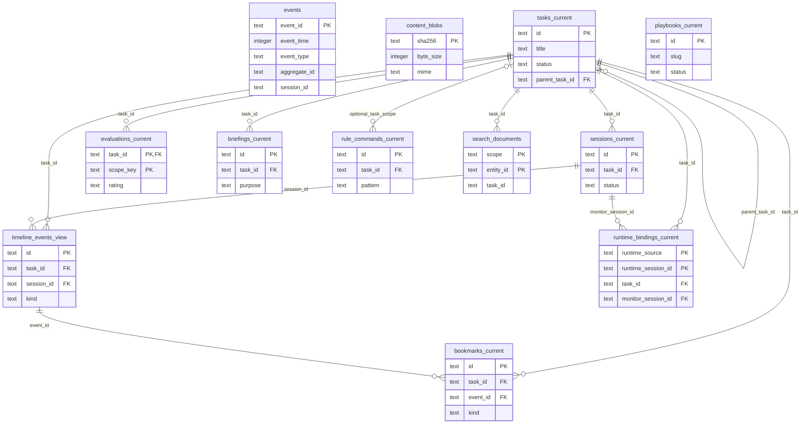

# SQLite Schema

The Agent Tracer server uses SQLite as its OLTP store. The schema consists of
an event log, a content-addressable blob store, current/view tables, and a
search index.

## Table Overview

| Layer | Table | Role |
|---|---|---|
| Event log | `events` | Append-only domain event log |
| Blob store | `content_blobs` | Stores large payloads and body blobs |
| Current state | `tasks_current` | Current task state |
| Current state | `sessions_current` | Current session state |
| Timeline view | `timeline_events_view` | Runtime timeline events |
| Current state | `runtime_bindings_current` | Runtime session bindings |
| Current state | `bookmarks_current` | Current bookmark state |
| Current state | `evaluations_current` | Current workflow evaluation state |
| Current state | `playbooks_current` | Current playbook state |
| Current state | `briefings_current` | Stores generated briefings |
| Current state | `rule_commands_current` | Current rule command state |
| Search index | `search_documents` | Search index for tasks/events/bookmarks |

## Relationship Diagram



`rule_commands_current.task_id` is nullable. When it is `null`, the row is a
global rule command. When it has a value, the row is a task-scoped rule command
that applies only to that task.

## `events`

```sql
create table if not exists events (
  event_id text primary key,
  event_time integer not null,
  event_type text not null,
  schema_ver integer not null,
  aggregate_id text not null,
  session_id text,
  actor text not null,
  correlation_id text,
  causation_id text,
  payload_json text not null,
  recorded_at integer not null
);
```

| Column | Type | Description |
|---|---:|---|
| `event_id` | `text` | ULID event id |
| `event_time` | `integer` | Time when the event occurred, as Unix ms |
| `event_type` | `text` | Event type |
| `schema_ver` | `integer` | Event payload schema version |
| `aggregate_id` | `text` | Aggregate id, usually the task id |
| `session_id` | `text` | Related session id |
| `actor` | `text` | `user`, `claude`, `codex`, or `system` |
| `correlation_id` | `text` | Event group id |
| `causation_id` | `text` | Causal event id |
| `payload_json` | `text` | Event payload JSON |
| `recorded_at` | `integer` | Time when the row was recorded in the DB, as Unix ms |

Indexes:

```sql
create index if not exists idx_events_aggregate_time
  on events(aggregate_id, event_time);

create index if not exists idx_events_type_time
  on events(event_type, event_time);

create index if not exists idx_events_session_time
  on events(session_id, event_time);

create index if not exists idx_events_correlation
  on events(correlation_id);
```

## `content_blobs`

```sql
create table if not exists content_blobs (
  sha256 text primary key,
  byte_size integer not null,
  mime text,
  created_at integer not null,
  body blob not null
);
```

| Column | Type | Description |
|---|---:|---|
| `sha256` | `text` | Content hash |
| `byte_size` | `integer` | Byte size |
| `mime` | `text` | MIME type |
| `created_at` | `integer` | Time when the blob was stored, as Unix ms |
| `body` | `blob` | Original bytes |

## `tasks_current`

This is the current read model for tasks. Screen lists, task detail views,
hierarchies, and overview counts are read from this table.

```sql
create table if not exists tasks_current (
  id text primary key,
  title text not null,
  slug text not null,
  workspace_path text,
  status text not null,
  task_kind text not null default 'primary',
  parent_task_id text,
  parent_session_id text,
  background_task_id text,
  created_at text not null,
  updated_at text not null,
  last_session_started_at text,
  cli_source text
);
```

| Column | Type | Description |
|---|---:|---|
| `id` | `text` | Task id |
| `title` | `text` | Default task title |
| `slug` | `text` | Slug derived from the title |
| `workspace_path` | `text` | Workspace path linked to the task |
| `status` | `text` | Task status |
| `task_kind` | `text` | Task kind, such as `primary` or `background` |
| `parent_task_id` | `text` | Parent task id |
| `parent_session_id` | `text` | Parent session id |
| `background_task_id` | `text` | External/background task id |
| `created_at` | `text` | Creation time, as an ISO string |
| `updated_at` | `text` | Update time, as an ISO string |
| `last_session_started_at` | `text` | Time when the most recent session started |
| `cli_source` | `text` | Runtime source |

Indexes:

```sql
create index if not exists idx_tasks_current_updated
  on tasks_current(updated_at desc);

create index if not exists idx_tasks_current_parent
  on tasks_current(parent_task_id, updated_at desc);
```

## `sessions_current`

This is the current read model for task execution sessions. Active session
queries and per-task session list queries are based on this table.

```sql
create table if not exists sessions_current (
  id text primary key,
  task_id text not null,
  status text not null,
  summary text,
  started_at text not null,
  ended_at text
);
```

| Column | Type | Description |
|---|---:|---|
| `id` | `text` | Monitor session id |
| `task_id` | `text` | Owning task id |
| `status` | `text` | Session status |
| `summary` | `text` | Session completion summary |
| `started_at` | `text` | Start time, as an ISO string |
| `ended_at` | `text` | End time, as an ISO string |

Indexes:

```sql
create index if not exists idx_sessions_current_task_started
  on sessions_current(task_id, started_at);

create index if not exists idx_sessions_current_task_status_started
  on sessions_current(task_id, status, started_at desc);
```

## `timeline_events_view`

This is the read model for timeline events received from the runtime. It is
used for task timelines, search, and workflow snapshot generation.

```sql
create table if not exists timeline_events_view (
  id text primary key,
  task_id text not null references tasks_current(id) on delete cascade,
  session_id text references sessions_current(id) on delete set null,
  kind text not null,
  lane text not null,
  title text not null,
  body text,
  metadata_json text not null,
  classification_json text not null,
  created_at text not null
);
```

| Column | Type | Description |
|---|---:|---|
| `id` | `text` | Timeline event id |
| `task_id` | `text` | Owning task id |
| `session_id` | `text` | Owning session id |
| `kind` | `text` | Event kind |
| `lane` | `text` | UI lane / workflow lane |
| `title` | `text` | Event title |
| `body` | `text` | Event body |
| `metadata_json` | `text` | Runtime metadata JSON |
| `classification_json` | `text` | Classifier result JSON |
| `created_at` | `text` | Creation time, as an ISO string |

Indexes:

```sql
create index if not exists idx_timeline_events_view_task_created
  on timeline_events_view(task_id, created_at);
```

## `runtime_bindings_current`

Connects external runtime session ids to Agent Tracer task/session ids. Runtime
hooks use this table when reusing or continuing a monitor session.

```sql
create table if not exists runtime_bindings_current (
  runtime_source text not null,
  runtime_session_id text not null,
  task_id text not null references tasks_current(id) on delete cascade,
  monitor_session_id text references sessions_current(id) on delete set null,
  created_at text not null,
  updated_at text not null,
  primary key (runtime_source, runtime_session_id)
);
```

| Column | Type | Description |
|---|---:|---|
| `runtime_source` | `text` | Runtime name |
| `runtime_session_id` | `text` | Session id provided by the runtime |
| `task_id` | `text` | Linked task id |
| `monitor_session_id` | `text` | Linked monitor session id |
| `created_at` | `text` | Initial binding time |
| `updated_at` | `text` | Last update time |

## `bookmarks_current`

Stores user bookmarks for tasks or timeline events.

```sql
create table if not exists bookmarks_current (
  id text primary key,
  task_id text not null references tasks_current(id) on delete cascade,
  event_id text references timeline_events_view(id) on delete cascade,
  kind text not null,
  title text not null,
  note text,
  metadata_json text not null default '{}',
  created_at text not null,
  updated_at text not null
);
```

| Column | Type | Description |
|---|---:|---|
| `id` | `text` | Bookmark id |
| `task_id` | `text` | Owning task id |
| `event_id` | `text` | Linked timeline event id |
| `kind` | `text` | `task` or `event` |
| `title` | `text` | Bookmark title |
| `note` | `text` | User note |
| `metadata_json` | `text` | Bookmark metadata JSON |
| `created_at` | `text` | Creation time |
| `updated_at` | `text` | Update time |

Indexes:

```sql
create index if not exists idx_bookmarks_current_task_created
  on bookmarks_current(task_id, updated_at desc);

create index if not exists idx_bookmarks_current_event
  on bookmarks_current(event_id);
```

## `evaluations_current`

Stores task/turn evaluation results for workflow reuse. It keeps scoped
evaluations, search text, embeddings, reusable snapshots, and reusable context.

```sql
create table if not exists evaluations_current (
  task_id text not null references tasks_current(id) on delete cascade,
  scope_key text not null default 'task',
  scope_kind text not null default 'task' check(scope_kind in ('task', 'turn')),
  scope_label text not null default 'Whole task',
  turn_index integer,
  rating text not null check(rating in ('good', 'skip')),
  use_case text,
  workflow_tags text,
  outcome_note text,
  approach_note text,
  reuse_when text,
  watchouts text,
  version integer not null default 1,
  promoted_to text,
  reuse_count integer not null default 0,
  last_reused_at text,
  briefing_copy_count integer not null default 0,
  workflow_snapshot_json text,
  workflow_context text,
  search_text text,
  embedding text,
  embedding_model text,
  evaluated_at text not null,
  primary key (task_id, scope_key)
);
```

| Column | Type | Description |
|---|---:|---|
| `task_id` | `text` | Evaluated task id |
| `scope_key` | `text` | Evaluation scope id |
| `scope_kind` | `text` | `task` or `turn` |
| `scope_label` | `text` | Scope label for UI display |
| `turn_index` | `integer` | Turn index when the scope is a turn |
| `rating` | `text` | `good` or `skip` |
| `use_case` | `text` | Reuse use case |
| `workflow_tags` | `text` | Workflow tag JSON |
| `outcome_note` | `text` | Outcome description |
| `approach_note` | `text` | Approach description |
| `reuse_when` | `text` | Reuse conditions |
| `watchouts` | `text` | Watchouts |
| `version` | `integer` | Evaluation record version |
| `promoted_to` | `text` | Promoted playbook id |
| `reuse_count` | `integer` | Reuse count |
| `last_reused_at` | `text` | Last reuse time |
| `briefing_copy_count` | `integer` | Briefing copy count |
| `workflow_snapshot_json` | `text` | Reusable snapshot JSON |
| `workflow_context` | `text` | Reusable context text |
| `search_text` | `text` | Search text |
| `embedding` | `text` | Serialized embedding |
| `embedding_model` | `text` | Embedding model id |
| `evaluated_at` | `text` | Evaluation time |

Indexes:

```sql
create index if not exists idx_evaluations_current_rating
  on evaluations_current(rating);
```

## `playbooks_current`

Stores playbooks that generalize good workflows. This table is used for search,
recommendations, and library queries.

```sql
create table if not exists playbooks_current (
  id text primary key,
  title text not null,
  slug text unique not null,
  status text not null default 'draft',
  when_to_use text,
  prerequisites text,
  approach text,
  key_steps text,
  watchouts text,
  anti_patterns text,
  failure_modes text,
  variants text,
  related_playbook_ids text,
  source_snapshot_ids text,
  tags text,
  search_text text,
  embedding text,
  embedding_model text,
  use_count integer not null default 0,
  last_used_at text,
  created_at text not null,
  updated_at text not null
);
```

| Column | Type | Description |
|---|---:|---|
| `id` | `text` | Playbook id |
| `title` | `text` | Playbook title |
| `slug` | `text` | Unique slug |
| `status` | `text` | Playbook status |
| `when_to_use` | `text` | Usage situation |
| `prerequisites` | `text` | Prerequisites JSON |
| `approach` | `text` | Approach |
| `key_steps` | `text` | Key steps JSON |
| `watchouts` | `text` | Watchouts JSON |
| `anti_patterns` | `text` | Anti-pattern JSON |
| `failure_modes` | `text` | Failure modes JSON |
| `variants` | `text` | Variants JSON |
| `related_playbook_ids` | `text` | Related playbook id JSON |
| `source_snapshot_ids` | `text` | Source snapshot id JSON |
| `tags` | `text` | Tag JSON |
| `search_text` | `text` | Search text |
| `embedding` | `text` | Serialized embedding |
| `embedding_model` | `text` | Embedding model id |
| `use_count` | `integer` | Use count |
| `last_used_at` | `text` | Last use time |
| `created_at` | `text` | Creation time |
| `updated_at` | `text` | Update time |

Indexes:

```sql
create index if not exists idx_playbooks_current_status
  on playbooks_current(status);
```

## `briefings_current`

Stores briefings generated from task workflow content for a specific purpose and
format.

```sql
create table if not exists briefings_current (
  id text primary key,
  task_id text not null references tasks_current(id) on delete cascade,
  generated_at text not null,
  purpose text not null,
  format text not null,
  memo text,
  content text not null
);
```

| Column | Type | Description |
|---|---:|---|
| `id` | `text` | Briefing id |
| `task_id` | `text` | Owning task id |
| `generated_at` | `text` | Generation time |
| `purpose` | `text` | Briefing purpose |
| `format` | `text` | Briefing format |
| `memo` | `text` | User memo |
| `content` | `text` | Briefing body |

Indexes:

```sql
create index if not exists idx_briefings_current_task_generated
  on briefings_current(task_id, generated_at desc);
```

## `rule_commands_current`

Stores frequently used command/rule patterns.

```sql
create table if not exists rule_commands_current (
  id text primary key,
  pattern text not null,
  label text not null,
  task_id text references tasks_current(id) on delete cascade,
  created_at text not null
);
```

| Column | Type | Description |
|---|---:|---|
| `id` | `text` | Rule id |
| `pattern` | `text` | Match pattern |
| `label` | `text` | Display label |
| `task_id` | `text` | Task id when the rule applies only to a specific task |
| `created_at` | `text` | Creation time |

Indexes:

```sql
create index if not exists idx_rule_commands_current_task_id
  on rule_commands_current(task_id);
```

## `search_documents`

Stores normalized text and optional embeddings for searchable
tasks/events/bookmarks.

```sql
create table if not exists search_documents (
  scope text not null check(scope in ('task', 'event', 'bookmark')),
  entity_id text not null,
  task_id text,
  search_text text not null,
  embedding text,
  embedding_model text,
  updated_at text not null,
  primary key (scope, entity_id)
);
```

| Column | Type | Description |
|---|---:|---|
| `scope` | `text` | `task`, `event`, or `bookmark` |
| `entity_id` | `text` | Entity id within the scope |
| `task_id` | `text` | Linked task id |
| `search_text` | `text` | Normalized search text |
| `embedding` | `text` | Serialized embedding |
| `embedding_model` | `text` | Embedding model id |
| `updated_at` | `text` | Index update time |

Indexes:

```sql
create index if not exists idx_search_documents_scope_task_updated
  on search_documents(scope, task_id, updated_at desc);
```

## Event Catalog

| Group | Event type |
|---|---|
| Task | `task.created` |
| Task | `task.renamed` |
| Task | `task.status_changed` |
| Task | `task.hierarchy_changed` |
| Session | `session.started` |
| Session | `session.ended` |
| Session | `session.bound` |
| Runtime | `tool.invoked` |
| Runtime | `tool.result` |
| Runtime | `prompt.submitted` |
| Runtime | `completion.received` |
| Runtime | `classification.assigned` |
| Curation | `bookmark.added` |
| Curation | `bookmark.removed` |
| Curation | `evaluation.recorded` |
| Curation | `evaluation.reused` |
| Workflow | `playbook.drafted` |
| Workflow | `playbook.published` |
| Workflow | `playbook.used` |
| Workflow | `briefing.generated` |
| System | `rule_command.registered` |
| System | `rule_command.matched` |

## Event Store API

| API | Return / effect |
|---|---|
| `append(event)` | Appends a domain event to `events` |
| `readAggregate(aggregateId, from?)` | Returns aggregate events in chronological order |
| `readByType(type, range?)` | Returns events by type and time range |
| `putContentBlob(input)` | Stores a blob in `content_blobs` |
| `getContentBlob(sha256)` | Looks up a blob by hash |

## Replay CLI

```bash
tsx packages/server/src/main/replay-events.ts .monitor/monitor.sqlite <aggregate-id>
```

```bash
tsx packages/server/src/main/replay-events.ts .monitor/monitor.sqlite <aggregate-id> <from-event-id>
```
