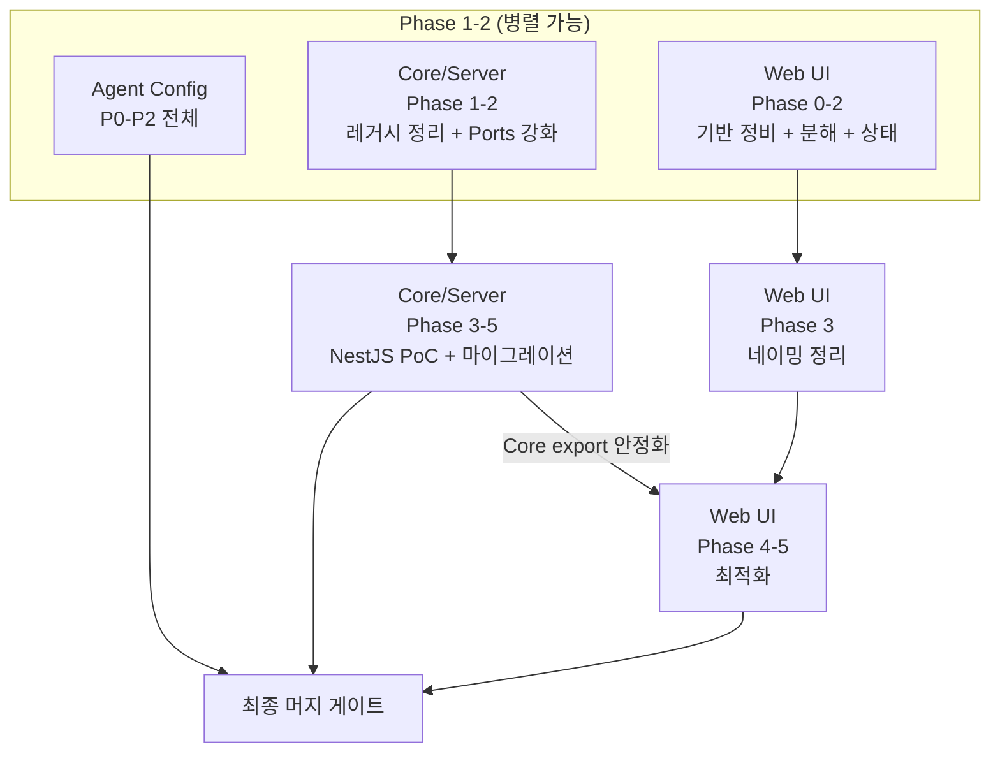
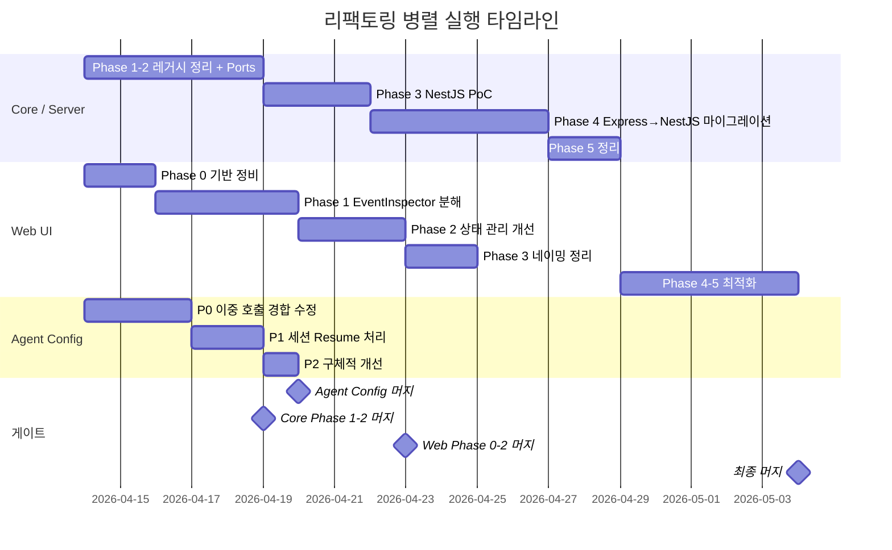

# 리팩토링 오케스트레이션

## 개요

3개 리팩토링 계획을 병렬로 조율하여 충돌 없이 진행하기 위한 통합 문서.

- [Core/Server 리팩토링](./core-server-refactor.md) — Express→NestJS, 레거시 정리
- [Web UI 리팩토링](./web-ui-refactor.md) — EventInspector 분해, 상태 관리
- [Agent Config 리뷰](./agent-config-review.md) — 훅 경합 수정, 개선

---

## 의존성 그래프



---

## 병렬 실행 스케줄



---

## 브랜치 전략

### 3개 독립 브랜치 (worktree)

```
main
 ├── refactor/core-server    # Core + Server 변경
 ├── refactor/web-ui         # Web 변경
 └── refactor/agent-config   # .claude/hooks/ 변경
```

각 브랜치는 별도 git worktree로 운영하여 동시 작업 가능:

```bash
git worktree add ../agent-tracer-core-server refactor/core-server
git worktree add ../agent-tracer-web-ui refactor/web-ui
git worktree add ../agent-tracer-agent-config refactor/agent-config
```

### 수정 영역 분리

| 브랜치 | 수정 대상 | 충돌 위험 |
|--------|-----------|-----------|
| `refactor/core-server` | `packages/core/`, `packages/server/` | Web과 Core export에서 |
| `refactor/web-ui` | `packages/web/` | Core와 import 경로에서 |
| `refactor/agent-config` | `.claude/hooks/`, `.claude/settings.json` | **없음** (완전 독립) |

---

## 머지 순서 및 게이트 조건

### 1단계: Agent Config 머지 (가장 먼저)

**게이트 조건:**
- [ ] P0 이중 호출 경합 해결 확인
- [ ] `npm run build && npm run test` 통과
- [ ] `.claude/hooks.log`로 실제 세션에서 중복 없음 확인

**충돌 위험**: 없음 — `.claude/` 디렉토리만 수정

### 2단계: Core/Server Phase 1-2 머지

**게이트 조건:**
- [ ] `monitor-database.ts` 삭제 후 빌드/테스트 통과
- [ ] Core re-export가 Web 브랜치에 영향 없음 확인
- [ ] `npm run build && npm run test` 전체 통과

**머지 후**: Web 브랜치에서 `git rebase main` 실행

### 3단계: Web Phase 0-2 머지

**게이트 조건:**
- [ ] EventInspector 분해 완료 (~10개 컴포넌트)
- [ ] 상태 관리 리팩토링 완료
- [ ] 모든 기존 테스트 통과 + 새 컴포넌트 테스트 추가
- [ ] `npm run build && npm run test` 전체 통과

### 4단계: Core/Server Phase 3-5 + Web Phase 3-5 순차 머지

**순서**: Core Phase 3-5 → Web Phase 3-5 (Core export 안정화 의존성)

**게이트 조건:**
- [ ] NestJS PoC 호환성 검증 완료
- [ ] API 계약 테스트 100% 통과 (Express/NestJS 동일 응답)
- [ ] Web에서 deprecated Core export 의존 제거 완료
- [ ] `npm run dev`로 server + web 동시 실행 정상 확인
- [ ] `npm run build && npm run test && npm run lint` 전체 통과

---

## 충돌 방지 규칙

### Core export 변경 시

Core `packages/core/src/index.ts`의 export를 변경할 때:

1. Web 브랜치 담당자에게 즉시 알림
2. 영향 파일 확인:
   ```bash
   grep -r "from \"@monitor/core\"" packages/web/src/ | sort
   ```
3. deprecated export는 Web 마이그레이션 완료 전까지 유지

### domain/types.ts 변경 시

`packages/core/src/domain/types.ts` 변경 시:

1. Web `packages/web/src/types.ts` 동기화 필요
2. 영향 범위: 16개 파일 (web-ui-refactor.md 참조)

### 동시 수정 금지 영역

| 파일 | 수정 권한 브랜치 |
|------|-----------------|
| `packages/core/src/index.ts` | `refactor/core-server` only |
| `packages/core/src/domain/*.ts` | `refactor/core-server` only |
| `packages/web/src/types.ts` | `refactor/web-ui` only |
| `.claude/hooks/*` | `refactor/agent-config` only |

---

## 검증 체크포인트

### 각 Phase 완료 시

```bash
npm run build && npm run test && npm run lint
```

### Core export 변경 후

```bash
# Web에서 깨지는 import 확인
grep -r "from \"@monitor/core\"" packages/web/src/ \
  | while read line; do echo "$line"; done

# 빌드 확인 (Web 포함)
npm run build
```

### NestJS PoC 검증

```bash
# supertest로 API 계약 테스트
npm run test --workspace @monitor/server

# 개발 서버 실행 확인
npm run dev:server
```

### 최종 검증

```bash
# 전체 빌드 + 테스트
npm run build && npm run test && npm run lint

# 개발 서버 동시 실행
npm run dev

# VitePress 문서 빌드
npm run docs:build
```

---

## 롤백 계획

각 머지 단계에서 문제 발생 시:

1. **Agent Config**: `git revert` — 독립적이므로 즉시 롤백 가능
2. **Core Phase 1-2**: `monitor-database.ts` 복원 (git에서 복구) + re-export 복원
3. **Web Phase 0-2**: EventInspector 원본 복원 (분해 전 상태)
4. **NestJS 마이그레이션**: Express 코드를 별도 브랜치에 보존해두어 즉시 전환 가능
