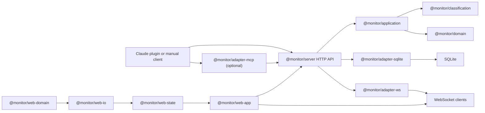

# Agent Tracer Overview

Agent Tracer turns agent activity into a structured execution record that
can be replayed, searched, rated, and inspected after the run. The repo
ships a local monitor server, a React dashboard, an MCP adapter, and a
Claude Code plugin. The important architectural change since the early
`@monitor/core` era is that the shared model is now split into
`@monitor/domain`, `@monitor/classification`, and `@monitor/application`.

## One-page picture

## What the system does

- Captures agent actions as canonical events such as `user.message`,
  `terminal.command`, `assistant.response`, `question.logged`, and
  `todo.logged`
- Classifies those events into timeline lanes and semantic subtypes on
  the server side
- Persists tasks, sessions, timeline events, bookmarks, and workflow
  evaluations in SQLite
- Pushes real-time updates over WebSocket so the dashboard can refresh
  without polling every view continuously
- Stores reusable task snapshots so later sessions can search for prior
  solutions

## Package groups

### Shared model

- `@monitor/domain`: pure ids, task/session/event types, workflow shapes,
  runtime capability registry, and shared interop contracts
- `@monitor/classification`: event classifier, action registry, and
  semantic metadata derivation
- `@monitor/application`: use cases, observability analyzers, workflow
  evaluation logic, and port interfaces

### Runtime and storage adapters

- `@monitor/adapter-http-ingest`: write-side Nest controllers
- `@monitor/adapter-http-query`: read-side Nest controllers
- `@monitor/adapter-sqlite`: SQLite-backed repository ports
- `@monitor/adapter-ws`: WebSocket broadcaster used by the server
- `@monitor/adapter-mcp`: stdio MCP server that forwards to the monitor
  HTTP API
- `@monitor/adapter-embedding`: local embedding service used by workflow
  similarity search
- `@monitor/claude-plugin`: Claude Code hook plugin package surfaced in
  this repo as `.claude/plugin`

### Server and web

- `@monitor/server`: NestJS composition root that wires the adapters and
  exposes the runtime
- `@monitor/web-domain`: web-facing read-model types and pure selectors
- `@monitor/web-io`: browser-boundary adapters for HTTP, WebSocket, and
  storage
- `@monitor/web-state`: React Query plus UI-store layer for the dashboard
- `@monitor/web-app`: React 19 dashboard

## End-to-end flow

1. A runtime posts an event through the Claude plugin, direct HTTP, or
   the MCP adapter.
2. `@monitor/server` routes the request into `@monitor/application`.
3. `@monitor/application` records lifecycle changes and delegates event
   classification to `@monitor/classification`.
4. `@monitor/adapter-sqlite` persists the result.
5. `@monitor/adapter-ws` broadcasts a notification.
6. `@monitor/web-app` reacts through `@monitor/web-state`, which
   invalidates the relevant queries and updates ephemeral UI selection.

## Core concepts

### Task

A unit of user intent. Task state is `running`, `waiting`, `completed`,
or `errored`, and tasks can have parent/child lineage.

### Session

An execution segment inside a task. Runtime sessions can end and be
re-bound to the same task across turn boundaries, which is how Claude
turns remain attached to one task history.

### Timeline event

The atomic observation unit. Every event has a canonical kind, may carry
a lane and semantic metadata, and becomes part of the task timeline.

### Workflow library

Completed tasks can be saved as reusable snapshots. Those snapshots are
searchable later and are the basis of the playbook / knowledge views in
the dashboard.

## Where to read the code first

- `packages/domain/src/index.ts`
- `packages/classification/src/index.ts`
- `packages/application/src/monitor-service.ts`
- `packages/server/src/bootstrap/create-nestjs-monitor-runtime.ts`
- `packages/hook-plugin/hooks/`
- `packages/adapter-mcp/src/index.ts`
- `packages/web-app/src/App.tsx`
- `packages/web-state/src/index.ts`

## Next

- [Getting Started & Installation](./getting-started-and-installation.md)
- [Architecture & Package Map](./architecture-and-package-map.md)
- [Core Domain & Event Model](./core-domain-and-event-model.md)
- [Monitor Server](./monitor-server.md)
- [Web Dashboard](./web-dashboard.md)
