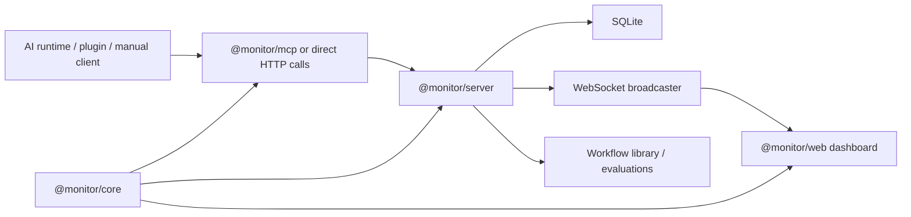

# Agent Tracer Overview

Agent Tracer turns AI agent activity into a structured, re-readable
execution record. The repo ships a local monitor server, a React
dashboard, an MCP surface, and a Claude Code plugin adapter. Everything
is wired around a shared event contract in `@monitor/core`, so the
server, MCP, and web can evolve in lockstep.

## One-page picture

## What the system does

- Classifies agent activity into 8 timeline lanes (`user`, `exploration`,
  `planning`, `implementation`, `questions`, `todos`, `background`,
  `coordination`) in real time.
- Funnels Claude plugin hook events and manual MCP calls into a single
  canonical event model.
- Persists everything to SQLite and broadcasts change notifications over
  WebSocket to the dashboard.
- Lets you evaluate completed tasks (`good` / `skip`) and store them in
  a workflow library that other sessions can search for reuse.

## Packages

### `@monitor/core`

The shared contract layer. `TimelineLane`, `MonitoringTask`,
`TimelineEvent`, the runtime capability registry, the event classifier,
and workflow evaluation types all live here. Everyone else imports from
core, so it is the source of truth.

- Entry points: `packages/core/src/domain/index.ts` (barrel),
  `packages/core/src/interop/event-semantic.ts`,
  `packages/core/src/runtime/index.ts`

### `@monitor/server`

The application + infrastructure layer. Runs on NestJS with an Express
adapter, using SQLite for persistence and a WebSocket broadcaster for
real-time notifications. Responsible for:

- task / session / runtime-session lifecycle
- timeline event ingestion + classification
- bookmark CRUD
- workflow evaluation and similarity search
- read models for overview, task detail, and observability
- WebSocket broadcast of every change

- Entry points: `packages/server/src/index.ts`,
  `packages/server/src/bootstrap/create-nestjs-monitor-runtime.ts`,
  `packages/server/src/application/monitor-service.ts`

### `@monitor/mcp`

Wraps the monitor server's HTTP API as a 24-tool MCP surface so agent
runtimes can call it directly when there is no auto-tracing plugin.

- Entry points: `packages/mcp/src/index.ts`, `packages/mcp/src/client.ts`

### `@monitor/web`

React 19 dashboard. Renders the task list, timeline, event inspector,
and workflow library in one view. Uses WebSocket hints plus REST read
models to refresh state.

- Entry points: `packages/web/src/App.tsx`,
  `packages/web/src/store/useMonitorStore.tsx`,
  `packages/web/src/lib/eventSubtype.ts`

## End-to-end flow

1. A runtime adapter (Claude plugin or a manual HTTP/MCP caller) posts
   an event to Agent Tracer.
2. The server routes it through `MonitorService`, which creates or
   updates a task, session, or timeline event.
3. The SQLite repository persists the change.
4. `EventBroadcaster` ships a typed notification over WebSocket.
5. The dashboard refreshes the relevant read model (overview, task
   detail, bookmarks, or observability).

## Core concepts

### Task

A unit of user intent. State is `running`, `waiting`, `completed`, or
`errored`. Supports parent/child relationships and background lineage.

### Session

An individual agent execution segment inside a task. Claude Code turns
map to runtime sessions — multiple runtime sessions can bind to the
same task, which is how long-running work survives a turn boundary.

### Timeline event

The atomic observation unit: user message, tool use, terminal command,
verification, todo, question, or assistant response. Every event
carries a lane, metadata, and classification.

### Workflow library

After a task finishes you can evaluate it and keep it as a reusable
example. The workflow library stores a snapshot + context markdown +
similarity read model so future sessions can search for "how did I
solve something like this last time".

## Where to read the code first

- `packages/server/src/bootstrap/create-nestjs-monitor-runtime.ts`
- `packages/server/src/application/monitor-service.ts`
- `packages/core/src/domain/index.ts`
- `packages/core/src/interop/event-semantic.ts`
- `packages/mcp/src/index.ts`
- `packages/web/src/App.tsx`
- `packages/web/src/store/useMonitorStore.tsx`

## Next

- [Getting Started & Installation](./getting-started-and-installation.md)
- [Architecture & Package Map](./architecture-and-package-map.md)
- [Core Domain & Event Model](./core-domain-and-event-model.md)
- [Monitor Server](./monitor-server.md)
- [Web Dashboard](./web-dashboard.md)
