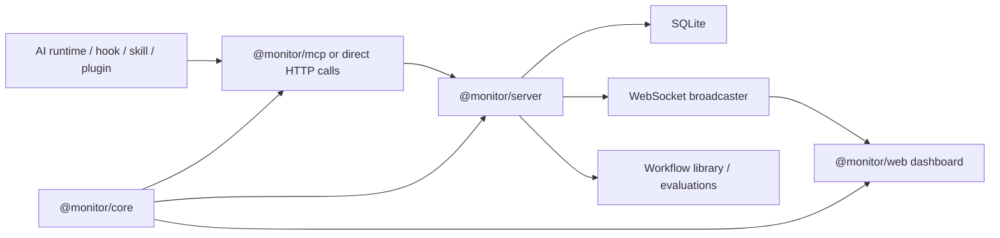

# System Overview

Agent Tracer는 AI 에이전트의 작업 흐름을 수집해서 로컬 서버에 저장하고,
웹 대시보드와 MCP 도구를 통해 다시 조회하고 활용하는 모노레포다.

## 한 장 요약

## 패키지 경계

### `packages/core`

- 이벤트 타입, 레인, 분류 모델, 런타임 capability 같은 공통 계약을 둔다.
- 서버와 MCP, 웹이 모두 여기에 기대기 때문에 사실상의 source of truth 역할을 한다.

### `packages/server`

- HTTP API, SQLite 저장소, WebSocket 브로드캐스터, 애플리케이션 서비스를 가진다.
- `createMonitorRuntime()`이 전체 조합 루트다.

### `packages/mcp`

- monitor-server HTTP API를 MCP tool surface로 노출한다.
- Codex/Claude/OpenCode가 수동 또는 스킬 기반으로 이벤트를 남길 수 있게 한다.

### `packages/web`

- 실시간 대시보드다.
- 태스크 목록, 타임라인, 인스펙터, 워크플로우 라이브러리 UI를 제공한다.

## 요청 흐름

1. 런타임 어댑터가 HTTP 또는 MCP tool로 이벤트를 기록한다.
2. 서버는 `MonitorService`를 통해 태스크/세션/이벤트를 저장한다.
3. SQLite 저장소가 영속성을 담당한다.
4. 서버는 변경 알림을 WebSocket으로 브로드캐스트한다.
5. 웹은 이벤트 payload를 직접 반영하기보다 overview/task detail을 다시 조회해 화면을 갱신한다.

## 핵심 설계에서 좋은 점

- 모노레포 패키지 경계가 명확하다.
- `@monitor/core`가 이벤트 계약을 중심에서 잡아 준다.
- 서버는 `application / presentation / infrastructure` 구조를 취하고 있다.
- 런타임별 차이를 문서와 capability table로 정리해 둔 점이 좋다.

## 현재 구조에서 보이는 주의점

### 1. 계약은 중앙화됐고, 최근 웹도 그 방향으로 더 수렴했다

- `packages/core/src/domain.ts`가 핵심 계약을 제공하고,
  웹도 이제 `packages/web/src/types.ts`에서 주요 타입을 `@monitor/core`에서 직접 재export한다.
- 완전히 해결된 것은 아니지만, 예전보다 서버와 웹의 조용한 drift 가능성은 줄었다.

### 2. "기능 확장"은 빠르지만 "구조 분해"는 아직 덜 됐다

- 서버의 `MonitorService`
- 웹의 `App`, `useMonitorStore`, `Timeline`, `EventInspector`, `insights`
- MCP의 단일 등록 파일

위 모듈들은 모두 제품 성장을 빠르게 흡수했지만,
이제는 유지보수 비용이 서서히 올라가기 시작한 단계로 보인다.

### 3. 문서가 설치 중심으로 편향되어 있었다

- 기존 `docs/guide`는 외부 프로젝트 연결과 런타임 설정을 잘 설명한다.
- 반면 "코드가 어떻게 연결되는가"를 한 번에 보는 문서는 부족했다.

## 저장소 안에서 먼저 읽을 파일

- `packages/server/src/bootstrap/create-monitor-runtime.ts`
- `packages/server/src/application/monitor-service.ts`
- `packages/core/src/domain.ts`
- `packages/mcp/src/index.ts`
- `packages/web/src/App.tsx`
- `packages/web/src/store/useMonitorStore.tsx`

## 구조 개선 우선순위

1. 서버 use case를 lifecycle / event logging / bookmarks / evaluation으로 분리
2. 웹의 거대 컴포넌트와 계산 유틸을 feature 단위로 분해
3. WebSocket payload를 활용한 점진 갱신으로 재조회 비용 축소
4. workflow library와 evaluation read path의 read-model 비용 절감
5. 코드 이해 문서를 계속 업데이트하는 운영 루틴 정착
