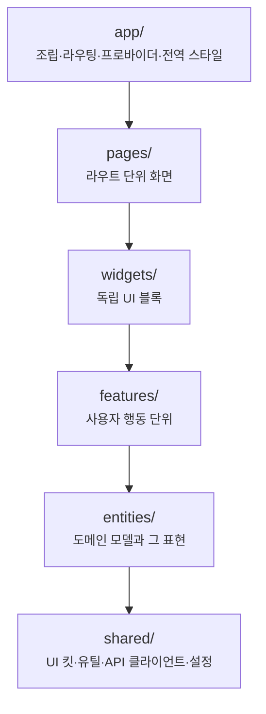

# packages/web

대시보드다. React와 Vite로 만든다.

## 레이어

Feature-Sliced Design 여섯 레이어를 쓴다. 위에서 아래로만 import한다.



같은 레이어의 슬라이스끼리는 직접 import하지 않는다. 목록 화면이 상세 화면을 부르고 싶으면
둘 다 위쪽 레이어가 조립한다.

## 라우트

| 경로 | 페이지 |
|---|---|
| `/tasks` | 태스크 목록 |
| `/tasks/:taskId` | 한 태스크의 타임라인 |
| `/rules` | 규칙과 판정 |
| `/recipes` | 레시피 후보와 적용 이력 |
| `/memos` | 메모 |
| `/tags` | 태그 관리와 태그별 모아보기 |
| `/jobs` | AI 잡의 진행·궤적·비용 |
| `/settings` | 언어 모델 키·에이전트 백엔드·정리 정책 |

서버 상태를 가져오는 훅은 그 도메인의 `entities/` 안에 산다. 전역 상태 폴더에 모으지 않는다.

## 이 패키지만의 제약

- 규칙은 둘뿐이다. 상위 레이어만 하위 레이어를 import하고, 같은 레이어의 슬라이스끼리는
  직접 import하지 않는다.
- `@monitor/kernel`의 `*.schema.ts`를 값으로 import하지 못한다. 웹 번들이 자립해야 하므로
  타입으로만 쓴다.
- 운영 UI 문자열은 영어로 쓴다. 사용자에게 보이는 한국어 설명 문구는 단일 카탈로그가
  소유하고, 화면은 그 카탈로그의 메시지를 렌더링만 한다. 화면 코드에 한국어 문자열을
  직접 박지 않는다.

## 검증

```bash
npx vitest run packages/web && npm run lint:deps
```

전체 게이트는 `npm run lint && npm run test && npm run lint:deps`다.
